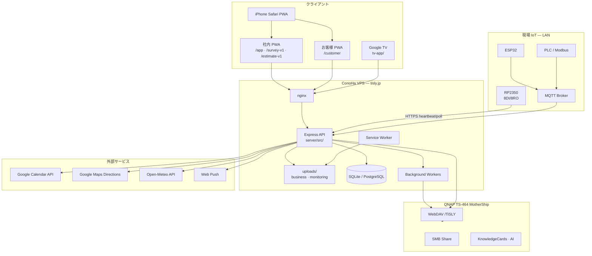
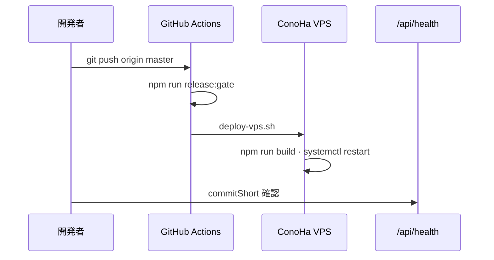

# TiSLY Architecture — システム構造とデータフロー

本ドキュメントは **2026-06 時点の実コード** に基づく TiSLY Platform の構成です。

---

## 1. 全体像



---

## 2. リポジトリとランタイム

| パス | 役割 |
|------|------|
| `server/src/index.ts` | HTTP + WebSocket 起動 |
| `server/src/app.ts` | Express ルート登録 |
| `server/public/` | PWA 静的アセット（HTML/JS/CSS） |
| `server/dist/` | `tsc` ビルド出力（本番はこちらを実行） |
| `server/src/shared/` | RN 流用向け純粋 TS モジュール |
| `tv-app/` | Google TV（Expo） |

**フレームワーク**: Next.js / React / Vite は使用していません。  
PWA は **Vanilla JS（ES Modules）+ Service Worker** です。

---

## 3. URL ゾーン分離

| ゾーン | 入口 | 用途 |
|--------|------|------|
| **internal** | `/app` | 社内実務（現調・見積・案件・設定） |
| **customer** | `/customer` | お客様向け（書類・見守り・連絡） |

実装: `server/src/shared/routes/tisly-routes-v1.ts` · `tisly-navigation-stack-v1.ts`

- ナビスタックは **ゾーン跨ぎ遷移を拒否**
- お客様 PWA `start_url`: `/customer`
- 旧 URL は 301 リダイレクト（`/estimate` → `/estimate-v1` 等）

---

## 4. 主要データフロー

### 4.1 現調 → 仕様書 PDF

```
survey-v1.js（写真撮影）
  → POST /api/survey/v1/projects/:id/photos
  → survey_photos テーブル
  → 現調完了時 POST .../from-survey
  → specification-template.ts（Puppeteer）
  → uploads/business/{projectId}/pdfs/specification-*.pdf
  → qnap-pdf-backup-worker → WebDAV（または mock ミラー）
```

**写真ルール**: 仕様書には `survey_photos` のみ。`completion_photos` は使わない。

### 4.2 見積・請求 PDF

```
estimate-v1.js
  → PATCH /api/estimate/v1/projects/:id/items
  → estimate-template.ts / invoice-template.ts
  → ローカル PDF 保存（写真なし includePhotos=false）
  → project_pdf_meta（QNAP バックアップ状態）
```

### 4.3 PDF 共有（iPhone / LINE）

```
pdf-share-v1.js
  → GET /api/estimate/v1/projects/:id/pdf（application/pdf 検証）
  → navigator.share({ files: [File] })  ← url/title/text 禁止
  → 非対応時: ダウンロードのみ
```

LINE にページ URL が混ざる問題を防ぐため、`clearBlobUrlsFromPage()` で blob: URL も除去。

### 4.4 日程・天気

```
schedule-v1.js
  → GET /api/schedule/v1/week
  → google-calendar-sync（GOOGLE_CALENDAR_ENABLED）
  → weather-service.ts → Open-Meteo API（または mock）
```

### 4.5 Google Calendar

```
/google-calendar-settings-v1
  → OAuth /auth/google/callback
  → google_calendar_event_links（案件↔予定）
  → 双方向同期ワーカー
```

### 4.6 RP2350 遠隔操作

```
/remote-test（PWA）
  → POST /api/remote-test/ch{N}/on|off
  → RP2350 poll（3秒）+ heartbeat（60秒）
  → chStates 同期 · Web Push 通知
```

ファームウェア: `rp2350/firmware/main.py`

### 4.7 監視 3D

```
/monitoring-3d-v2
  → GET /api/monitoring/v1/3d-scene
  → Three.js + mapAsset（GLB/OBJ/PLY）
  → device-attachments（写真・PDF リンク）
```

---

## 5. ストレージアーキテクチャ

| 層 | パス / 方式 | 正 / バックアップ |
|----|-------------|-------------------|
| VPS ローカル | `uploads/business/{projectId}/pdfs/` | **正** |
| VPS 写真 | DB + ファイルシステム | 正 |
| QNAP WebDAV | `/TiSLY/projects/{id}/...` | バックアップ |
| QNAP Mock | `uploads/qnap-storage-mock/` | 未設定時の疑似保存 |
| MotherShip SMB | `\\192.168.1.10\TiSLY` | 知識庫・ミラー |

判定: `server/src/storage/qnap-storage-v1-config.ts` — `resolveQnapStorageProviderKind()`  
UI: `/storage-settings-v1` — Mock / WebDAV 状態を表示

---

## 6. API レイヤ構成（抜粋）

```
server/src/
├── api/routes/          HTTP ルーター
├── business/            見積・請求・PDF テンプレ
├── estimate/            現調連携・仕様書・完了報告
├── schedule/            日程・天気・Maps
├── projects/            案件管理・PDF メタ
├── storage/             QNAP · ストレージ設定
├── knowledge/           ナレッジ検索・取得
├── monitoring/          3D 監視・mapAsset
├── customer-portal/     お客様 API
├── field-ops/           持ち物・発注・作業完了
├── mqtt/                MQTT サブスクライバ
└── workers/             QNAP バックアップ · Gmail · 等
```

---

## 7. 認証・マルチテナント

| 方式 | 用途 |
|------|------|
| JWT Bearer | 社内 API · 管理者 |
| `customerCode` スコープ | 顧客ポータル |
| `X-Remote-Test-Token` | RP2350 PoC |
| ロール | admin · surveyor · installer · viewer |

---

## 8. ビルド・デプロイ



---

## 9. テスト構成

- 場所: `server/test/*.test.ts`
- 実行: `cd server && npm run test`
- 重要スイート:
  - `pdf-share-files-only-v1.test.ts` — LINE 共有 files-only
  - `navigation-stack-v1.test.ts` — 戻るスタック
  - `qnap-pdf-backup-v1.test.ts` — QNAP バックアップ
  - `operational-phase*.test.ts` — 実運用フェーズ回帰

---

## 10. 関連ドキュメント

| ドキュメント | 内容 |
|-------------|------|
| [`TISLY_MASTER_VISION.md`](TISLY_MASTER_VISION.md) | 思想・ロードマップ |
| [`routes/ROUTE_CONTRACT.md`](routes/ROUTE_CONTRACT.md) | URL 契約 |
| [`project-pdf-storage-spec.md`](project-pdf-storage-spec.md) | PDF 保存仕様 |
| [`google_calendar_practical_pwa.md`](google_calendar_practical_pwa.md) | Calendar 連携 |
| [`autonomous/PROJECT_STATUS.md`](autonomous/PROJECT_STATUS.md) | 完成仕様 |
