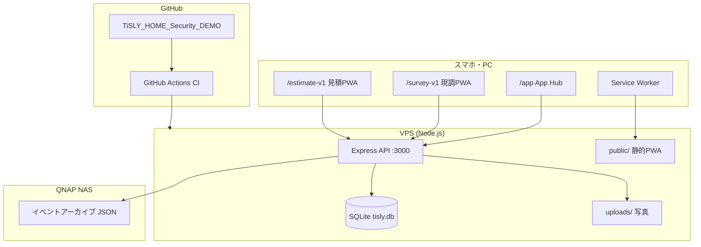

# システム接続図

## 全体像



## 実務 PWA フロー

```text
App Hub (/app)
  ├─ 現調PWA v1 (/survey-v1)
  │     └─ API /api/survey/v1
  │           └─ DB survey_projects, survey_photos, survey_materials
  │
  └─ 見積PWA v1 (/estimate-v1)
        └─ API /api/estimate/v1
              └─ DB business_projects, business_estimates
                    └─ TOMS形式 /toms-format (スタブ)
```

## 主要 URL

| 用途 | URL |
|------|-----|
| 実務入口 | `/app` |
| 現調 v1 | `/survey-v1` |
| 見積 v1 | `/estimate-v1` |
| Hub API | `/api/pwa/hub` |
| 現調 API | `/api/survey/v1` |
| 見積 API | `/api/estimate/v1` |
| ヘルス | `/api/health` |

## 認証

| 種別 | 方式 |
|------|------|
| 顧客ユーザー | `/api/auth/customer/login` → JWT Bearer |
| 管理者 | `/api/auth/login` → JWT Bearer |
| デバイス | デバイストークン（別系統） |

## データの流れ（現調→見積）

1. 現調で案件作成 → `survey_projects`
2. 写真・部材登録 → 子テーブル
3. 「見積へ送る」→ `workflow_status = estimate_pending`
4. 見積PWAで取り込み → `business_projects` 作成
5. 明細編集・確定 → PDF 生成 → `estimate_done`
