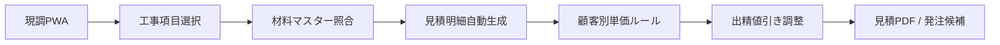

# 次フェーズ設計 — 持ち物・発注・材料マスター

**ステータス:** v1 実装済み（2026-06-11）  
**前提:** 現調 v1 / 見積 v1 / 日程 v1 / TOMS PDF v1.1 が完成済み

実装済み: 材料マスター / 工事テンプレ / 持ち物 PWA / 発注 PWA / 現調連動。詳細は [PROJECT_STATUS.md](./PROJECT_STATUS.md) の Field Operations System v1 を参照。

---

## 1. 持ち物 PWA

### 目的

案件ごとに必要な工具・材料・機器をチェックリスト化し、出発前の忘れ物を防ぐ。

### 主要機能

| 機能 | 説明 |
|------|------|
| 案件紐付けチェックリスト | 見積・仕様書の工事種別から必要品を自動提案 |
| 出発前チェック | 当日朝のワンタップ確認 UI |
| カスタム追加 | 現場固有の持ち物を手動追加 |
| 完了記録 | チェック済み状態を案件タイムラインに記録 |

### データモデル（案）

```
field_kit_items
  - id, project_id, label, category (tool|material|device)
  - quantity, checked_at, checked_by, sort_order
  - source (auto|manual), material_master_id (nullable)
```

### 工事種別 → 持ち物例

| 工事種別 | 持ち物例 |
|----------|----------|
| 防犯カメラ工事 | カメラ / NVR / PoE / LANケーブル / RJ45 / 圧着工具 / 脚立 / テスター |
| 換気扇交換 | 換気扇本体 / ドライバー / 脚立 / 養生テープ |
| 分電盤交換 | 分電盤 / テスター / 絶縁工具 / 養生シート |

### API（案）

- `GET /api/field/v1/projects/:id/kit` — チェックリスト取得
- `POST /api/field/v1/projects/:id/kit/generate` — 工事項目から自動生成
- `PATCH /api/field/v1/projects/:id/kit/:itemId` — チェック状態更新

---

## 2. 発注 PWA

### 目的

見積明細から不足材料を抽出し、発注〜入荷〜現場持込までを案件単位で追跡する。

### ステータスフロー

```
発注前 → 発注済 → 入荷済 → 現場持込済
```

### 主要機能

| 機能 | 説明 |
|------|------|
| 不足材料抽出 | 見積明細 × 在庫数で発注候補を算出 |
| 発注一覧 | 案件・納期・発注先でフィルタ |
| 入荷確認 | バーコード or 手動で入荷登録 |
| 持込確認 | 現場到着時に持込済みマーク |

### データモデル（案）

```
purchase_orders
  - id, project_id, vendor_id, status, ordered_at, received_at, carried_at
purchase_order_lines
  - id, order_id, material_master_id, label, qty_ordered, qty_received
```

### 見積連携

- 見積明細の `category` / `name` / `quantity` から材料マスターを照合
- 在庫不足分のみ発注候補に表示
- 顧客別単価ルールは発注原価には影響しない（売価計算のみ）

---

## 3. 材料マスター

### 目的

品名・型番・原価・売価倍率・在庫・発注先を一元管理し、見積・発注・持ち物の共通基盤とする。

### フィールド

| 項目 | 説明 |
|------|------|
| 品名 | 表示名（例: 屋外防犯カメラ 200万画素） |
| 型番 | メーカー型番 |
| 原価 | 仕入単価（税抜） |
| 売価倍率カテゴリ | material / labor — 顧客別単価ルールと連動 |
| 在庫数 | 倉庫在庫（リアルタイム更新は将来） |
| 発注先 | 仕入先マスター参照 |
| 工事項目紐付け | よく使う工事種別タグ |

### データモデル（案）

```
material_master
  - id, name, model_no, cost_price, pricing_category
  - stock_qty, vendor_id, tags_json, is_active
material_work_type_links
  - material_id, work_type (camera|ventilation|panel|...)
```

### 顧客別単価ルールとの関係

- 材料マスターの `cost_price` × 顧客ルール `costMultiplier` = 見積単価
- 手入力単価がある明細行は上書きしない（現行 `isPriceRuleTargetLineItem` と同様）
- `category: other` は手動調整専用

---

## 4. 現調 → 見積自動生成（拡張）

### 現状

- 現調の材料登録から見積案件を作成済み（`from-survey`）
- 顧客別単価ルール適用済み

### 次の拡張

| ステップ | 内容 |
|----------|------|
| 1 | 現調で選択した工事項目タグから見積明細テンプレを自動作成 |
| 2 | 材料マスター参照で原価・型番を自動入力 |
| 3 | 顧客別単価ルールで売価を一括計算 |
| 4 | 出精値引きで端数調整 → PDF 確定 |

### フロー図



---

## 5. 実装優先順位（提案）

1. **材料マスター** — 他機能のデータ基盤
2. **見積自動生成拡張** — 現調連携の価値最大化
3. **発注 PWA** — 材料マスター依存
4. **持ち物 PWA** — 発注・材料と並行可能だが優先度は低め

---

## 6. 壊してはいけない既存仕様

- 現調写真（`survey_photos`）と完了報告書用写真（`completion_photos`）の分離
- 顧客別単価ルールの手入力優先
- PDF 備考への倍率非表示（「顧客別単価ルール適用」のみ）
- VPS Auto Deploy 運用（手動 git pull 不要）
