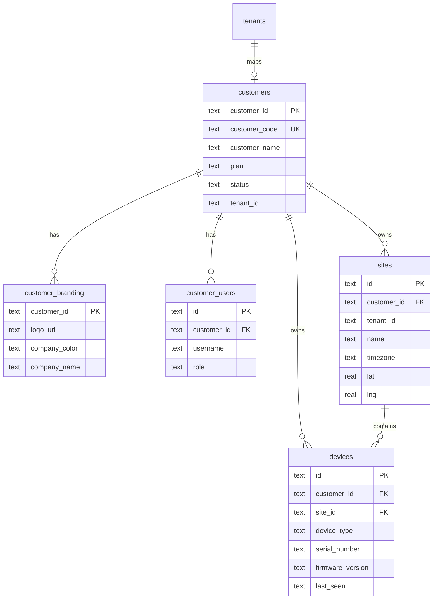

# ER 図 — Phase 221–240

```mermaid
erDiagram
  customers ||--o{ customer_branding : has
  customers ||--o{ customer_users : has
  customers ||--o{ sites : owns
  customers ||--o{ devices : owns
  sites ||--o{ devices : contains
  tenants ||--o| customers : maps
  customers {
    text customer_id PK
    text customer_code UK
    text customer_name
    text plan
    text status
    text tenant_id
  }
  customer_branding {
    text customer_id PK
    text logo_url
    text company_color
    text company_name
  }
  customer_users {
    text id PK
    text customer_id FK
    text username
    text role
  }
  sites {
    text id PK
    text customer_id FK
    text tenant_id
    text name
    text timezone
    real lat
    real lng
  }
  devices {
    text id PK
    text customer_id FK
    text site_id FK
    text device_type
    text serial_number
    text firmware_version
    text last_seen
  }
```
