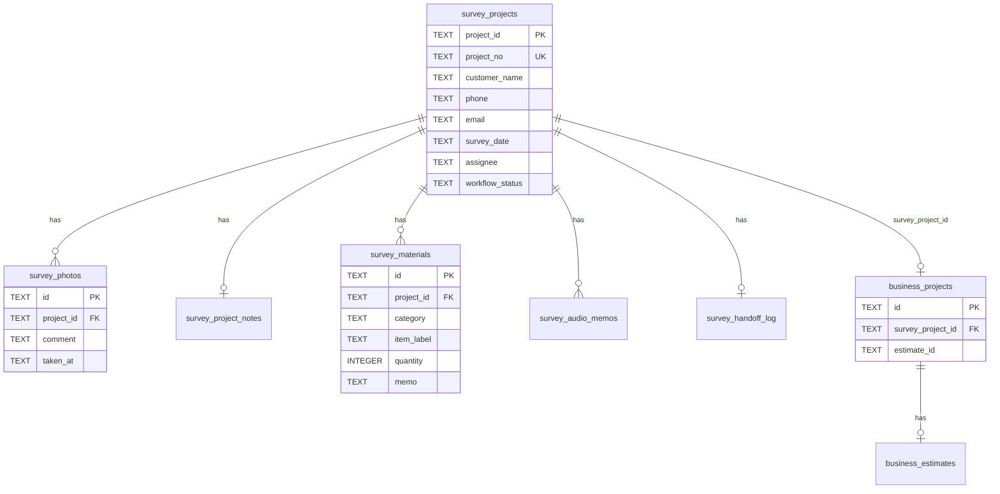

# TiSLY 現調PWA v1 — DB 設計

見積PWA（`business_projects` / `business_estimates`）へ引き継げるよう、既存 Survey スキーマを**拡張**する。新規の平行テーブルは作らない。

## ER 図



---

## テーブル定義

### survey_projects（拡張）

既存テーブルにカラム追加。

| カラム | 型 | NULL | 説明 |
|--------|-----|------|------|
| `project_id` | TEXT | PK | 内部 ID `SVY-XXXXXXXX` |
| `project_no` | TEXT | UNIQUE | 案件番号（表示用） |
| `customer_code` | TEXT | NOT NULL | テナント |
| `customer_name` | TEXT | | 顧客名（v1 必須） |
| `site_name` | TEXT | NOT NULL | 現場名 |
| `address` | TEXT | | 住所 |
| `phone` | TEXT | | 電話番号 |
| `email` | TEXT | | メール |
| `survey_date` | TEXT | | 現調日 `YYYY-MM-DD` |
| `assignee` | TEXT | | 担当者表示名 |
| `gps_lat` | REAL | | 既存（v1 任意） |
| `gps_lng` | REAL | | 既存（v1 任意） |
| `status` | TEXT | NOT NULL | レガシー `draft/active/completed/archived` |
| `workflow_status` | TEXT | NOT NULL DEFAULT 'surveying' | v1 ワークフロー |
| `created_at` | TEXT | | |
| `updated_at` | TEXT | | |

`workflow_status` 許容値:

```sql
CHECK (workflow_status IN (
  'surveying',
  'estimate_pending',
  'estimate_done',
  'ordered',
  'completed'
))
```

案件番号採番例: `G{YYYY}-{seq:04d}` — アプリ層で `survey_project_seq` 設定キーから取得。

---

### survey_photos（拡張）

| カラム | 型 | 説明 |
|--------|-----|------|
| `id` | TEXT PK | |
| `project_id` | TEXT FK | |
| `photo_type` | TEXT | v1 では `field` を主に使用。既存分類も維持 |
| `photo_path` | TEXT | 相対パス |
| `comment` | TEXT | 写真コメント（v1 追加） |
| `taken_at` | TEXT | 撮影日時 ISO8601（v1 追加） |
| `uploaded_by` | TEXT | |
| `created_at` | TEXT | アップロード日時 |

インデックス: `idx_survey_photos_project`（既存）

---

### survey_project_notes（既存）

| カラム | 型 | 説明 |
|--------|-----|------|
| `project_id` | TEXT PK FK | |
| `notes` | TEXT | フリーテキストメモ |
| `updated_at` | TEXT | |

---

### survey_materials（新規）

| カラム | 型 | NULL | 説明 |
|--------|-----|------|------|
| `id` | TEXT | PK | UUID |
| `project_id` | TEXT | NOT NULL FK | |
| `category` | TEXT | NOT NULL | 下表参照 |
| `item_label` | TEXT | | 機種・品名 |
| `quantity` | INTEGER | DEFAULT 1 | 数量 |
| `memo` | TEXT | | 補足 |
| `sort_order` | INTEGER | DEFAULT 0 | 表示順 |
| `created_at` | TEXT | | |
| `updated_at` | TEXT | | |

`category` CHECK:

```sql
CHECK (category IN (
  'camera', 'lan', 'wifi', 'electrical',
  'lighting', 'intercom', 'aircon', 'other'
))
```

インデックス: `idx_survey_materials_project ON survey_materials(project_id)`

---

### survey_audio_memos（既存・変更なし）

音声ファイルパス・文字起こしテキストを保持。v1 メモ画面から参照。

---

### survey_handoff_log（新規）

見積PWA への引き渡し監査。

| カラム | 型 | 説明 |
|--------|-----|------|
| `id` | TEXT PK | |
| `survey_project_id` | TEXT FK UNIQUE | 1 現調 1 回の引き渡し |
| `business_project_id` | TEXT | 作成された business project |
| `handoff_by` | TEXT | ユーザー ID |
| `handoff_at` | TEXT | |
| `payload_json` | TEXT | スナップショット（部材件数等） |

---

## 見積PWA 連携マッピング

### 1. 引き渡しトリガー

`workflow_status` が `estimate_pending` のときのみ `handoff-to-estimate` を許可。

### 2. business_projects 作成

```text
survey_projects.customer_name  → business_projects.customer_name, title
survey_projects.address        → business_projects.address
survey_projects.phone          → business_projects.phone
survey_projects.project_id     → business_projects.survey_project_id
```

`business_customers` は `BCU-SVY-{customer_code}` または既存顧客マッチで作成（既存 `businessFromSurveyService` パターン）。

### 3. 見積ドラフトのシード

`survey_materials` 各行を `business_estimates.items_json` の初期行に変換:

```json
{
  "category": "camera",
  "name": "防犯カメラ（現調）",
  "description": "{item_label} {memo}",
  "quantity": 1,
  "unit": "式",
  "unitPrice": 0,
  "source": "survey_material",
  "surveyMaterialId": "{id}"
}
```

単価は見積PWA で `pricing_rules` から補完。

### 4. 状態の同期

| survey workflow_status | business_projects.status（目安） |
|------------------------|----------------------------------|
| `estimate_pending` | `survey_done` |
| `estimate_done` | `estimate_created` または `estimate_sent` |
| `ordered` | `accepted` |
| `completed` | `closed` |

見積PWA 側の API が `survey_projects.workflow_status` を PATCH するコールバックを将来追加。

### 5. 写真・メモ

| 現調 | 見積 |
|------|------|
| `survey_photos` | `business_projects.survey_photos_json`（ファイルコピー） |
| `survey_project_notes.notes` | `business_projects.survey_memo` |

---

## マイグレーション

マーカー: `migration:field_survey_pwa_v1`

実装: `server/src/db/migrate.ts` → `migrateFieldSurveyPwaV1()`

起動時に `addColumnsIfMissing` で `survey_projects` / `survey_photos` を拡張し、新規テーブルを `CREATE IF NOT EXISTS`。

---

## PostgreSQL 移行時の注意

`server/src/db/postgres/` に同義の DDL を追記する際:

- `workflow_status` に ENUM または CHECK 制約
- `survey_handoff_log.survey_project_id` に UNIQUE
- 既存 RLS ポリシーに `survey_materials` を `customer_code` 経由で追加

---

## 型定義（TypeScript 予定）

`server/src/survey/survey-v1-types.ts`:

```typescript
export const SURVEY_WORKFLOW_STATUSES = [
  "surveying",
  "estimate_pending",
  "estimate_done",
  "ordered",
  "completed",
] as const;

export const SURVEY_MATERIAL_CATEGORIES = [
  "camera", "lan", "wifi", "electrical",
  "lighting", "intercom", "aircon", "other",
] as const;
```
