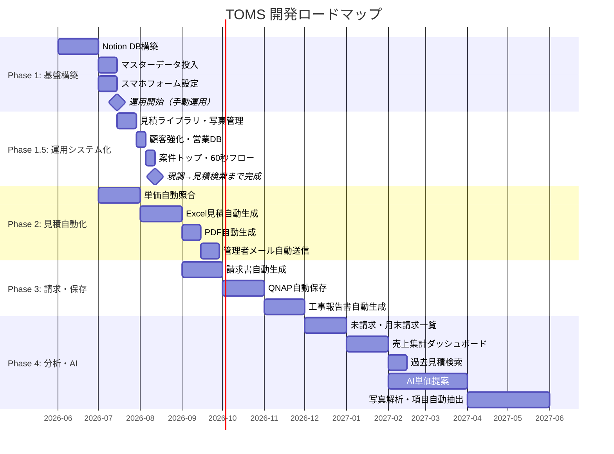
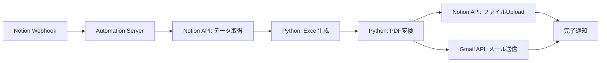

# TOMS 将来拡張ロードマップ

> **TOMS** — 現調 → 見積 → 請求 自動化システム（Notion基盤）  
> 最終更新: 2026-05-31

---

## 1. ロードマップ概要



---

## 2. フェーズ詳細

### Phase 1: 基盤構築（2026年6月）

**目標**: Notion上で手動運用可能な状態を作る

| # | 機能 | 状態 | 内容 |
|---|------|------|------|
| 1.1 | Notion DB構築 | 🔲 未着手 | 7 DB作成、関連設定、Formula設定 |
| 1.2 | マスターデータ投入 | 🔲 未着手 | 顧客マスター・単価マスター初期データ |
| 1.3 | スマホフォーム | 🔲 未着手 | 現調DBフォームビュー設定 |
| 1.4 | ダッシュボード | 🔲 未着手 | 今日の現調・進行中案件ビュー |
| 1.5 | 運用マニュアル | ✅ 完了 | workflow.md |

#### 成果物

- Notion ワークスペース（7 DB）
- スマホブックマーク用フォームURL
- 運用マニュアル

#### 成功基準

- [ ] 現場担当がスマホから3分以内で現調入力できる
- [ ] 案件の状態管理がカンバンで視覚化されている
- [ ] 顧客選択で補正率が自動表示される

---

### Phase 1.5: 運用システム化（Phase 1 完了後 〜2週間）

**目標**: Notion を「設計」から「毎日使える運用システム」へ。現調 → 写真 → 過去見積検索 → 見積作成までを Notion 上で完結させる。

| # | 機能 | 状態 | 内容 |
|---|------|------|------|
| 1.5.1 | 見積ライブラリDB | 📄 設計完了 | 過去見積検索・類似案件・AI単価のデータ基盤 |
| 1.5.2 | 工事写真管理DB | 📄 設計完了 | 現調/施工前/中/後/完成の工程別写真 |
| 1.5.3 | 顧客マスター強化 | 📄 設計完了 | ランク・年間売上・紹介元・注意事項 |
| 1.5.4 | 営業ダッシュボード | 📄 設計完了 | 今月見積/受注/売上・未請求・未入金 |
| 1.5.5 | 案件トップページ | 📄 設計完了 | 案件情報→現調→写真→見積→報告→請求を1画面 |
| 1.5.6 | スマホ60秒フロー | 📄 設計完了 | 案件作成→写真→現調→保存 |

#### Phase 1.5 完了後のフロー

```
現調 → Notion入力（60秒） → 写真保存 → 過去見積検索 → 見積作成
```

#### Phase 2 への接続（推奨順序）

```
Notion（Phase 1.5）
  → Excel自動生成
  → PDF
  → QNAP保存
  → 智紀さんの仕事用メールへ通知
```

#### 成果物

- [notion_phase1_5.md](./notion_phase1_5.md) — 全体概要・構築順序
- [estimate_library.md](./estimate_library.md) — 見積ライブラリDB
- [photo_management.md](./photo_management.md) — 工事写真管理DB
- [customer_management.md](./customer_management.md) — 顧客管理強化
- [dashboard_design.md](./dashboard_design.md) — 営業ダッシュボード

#### 成功基準

- [ ] 過去見積を工事分類で検索できる
- [ ] 案件トップで現調〜請求が1ページで見える
- [ ] 営業ダッシュボードで今月KPIを確認できる
- [ ] スマホから60秒以内で現調1件を入力できる

---

### Phase 2: 見積自動化（2026年7〜8月）

**目標**: 現調データから見積書PDFまで自動生成

| # | 機能 | 優先度 | 技術要素 |
|---|------|--------|---------|
| 2.1 | 単価自動照合 | 高 | Notion Formula + 単価マスターRelation |
| 2.2 | 見積DB自動生成 | 高 | Notion Automation / Make / n8n |
| 2.3 | Excel見積自動生成 | 高 | Python (openpyxl) + TOMS標準見積フォーマット.xlsx |
| 2.4 | PDF自動生成 | 高 | Python (reportlab) or Excel→PDF変換 |
| 2.5 | 管理者メール自動送信 | 高 | Gmail API / SMTP |

#### 2.3 Excel見積自動生成 — 詳細設計

```
入力:
  - 見積DB レコードID
  - 関連する現調DB項目一覧
  - 顧客情報（Rollup）

処理:
  1. TOMS標準見積フォーマット.xlsx をテンプレートとして読込
  2. ヘッダー部に顧客名・案件名・見積番号・作成日を転記
  3. 明細行に工事項目（場所/分類/作業/型式/数量/単価/金額）を転記
  4. 小計・消費税・税込合計を転記
  5. ファイル保存 → Notion にアップロード

出力:
  - {案件名}_見積_{YYYYMMDD}.xlsx
  - {案件名}_見積_{YYYYMMDD}.pdf
```

#### 2.3 テンプレートマッピング（TOMS標準見積フォーマット.xlsx）

| Excelセル | Notionソース |
|-----------|-------------|
| 見積番号 | 見積DB → 見積番号 |
| 作成日 | 見積DB → 作成日 |
| 顧客名 | 見積DB → 顧客名 |
| 案件名 | 案件管理DB → 案件名 |
| 明細: 場所 | 現調DB → 場所 |
| 明細: 工事内容 | 現調DB → 工事分類 + 作業内容 |
| 明細: 型式 | 現調DB → 型式・サイズ |
| 明細: 数量 | 現調DB → 数量 |
| 明細: 単価 | 現調DB → 見積単価 |
| 明細: 金額 | 現調DB → 見積金額 |
| 小計 | 見積DB → 小計 |
| 消費税 | 見積DB → 消費税 |
| 合計 | 見積DB → 税込合計 |

#### 自動化アーキテクチャ（Phase 2）



#### 成功基準

- [ ] 現調完了 → 見積PDF生成まで10分以内（無人）
- [ ] Excel出力がTOMS標準フォーマットと一致
- [ ] 管理者メールが自動送信される
- [ ] お客様への自動送信が行われない

---

### Phase 3: 請求・保存自動化（2026年9〜11月）

**目標**: 請求書生成からQNAP保存まで自動化

| # | 機能 | 優先度 | 技術要素 |
|---|------|--------|---------|
| 3.1 | 請求書Excel/PDF自動生成 | 高 | Phase 2と同様のパイプライン |
| 3.2 | QNAP自動保存 | 高 | QNAP WebDAV / SMB / API |
| 3.3 | 工事報告書PDF自動生成 | 中 | テンプレートベース生成 |
| 3.4 | 写真自動アップロード | 中 | Notion → QNAP 同期 |

#### 3.2 QNAP自動保存 — 詳細設計

```
トリガー: 見積PDF生成完了 / 請求PDF生成完了

保存処理:
  1. QNAP に接続（WebDAV or SMB）
  2. パス生成: /TOMS/{顧客名}/{案件名}/
  3. フォルダが存在しなければ作成
  4. ファイルをアップロード:
     - 見積書.xlsx / 見積書.pdf
     - 請求書.xlsx / 請求書.pdf
     - 現調写真/ （Notionから取得）
     - 工事報告書.pdf
  5. 保存完了をNotionに記録
```

#### 3.3 請求書テンプレート

| 項目 | ソース |
|------|--------|
| 請求番号 | 請求DB → 請求番号 |
| 請求日 | 請求DB → 請求日 |
| 支払期限 | 請求DB → 支払期限 |
| 請求先 | 顧客マスター → 顧客名 |
| 案件名 | 案件管理DB → 案件名 |
| 明細 | 見積DB → 工事項目（または請求DB直接） |
| 請求金額 | 請求DB → 請求金額 |
| 消費税 | 請求DB → 消費税 |
| 税込金額 | 請求DB → 税込金額 |

#### 成功基準

- [ ] 請求書が見積データから自動生成される
- [ ] QNAPのフォルダ構成が自動作成される
- [ ] 現調写真がQNAPに自動同期される

---

### Phase 4: 分析・AI（2026年12月〜2027年4月）

**目標**: 経営判断を支援する分析機能とAI活用

| # | 機能 | 優先度 | 概要 |
|---|------|--------|------|
| 4.1 | 未請求一覧 | 高 | 施工完了 & 請求済でない案件を自動抽出 |
| 4.2 | 月末請求一覧 | 高 | 請求締日ベースの請求対象案件一覧 |
| 4.3 | 売上集計 | 中 | 月次/顧客別/分類別の売上ダッシュボード |
| 4.4 | 過去見積検索 | 中 | 型式・分類・顧客での見積履歴検索 |
| 4.5 | AI単価提案 | 低 | 過去データから適正単価を提案 |
| 4.6 | 写真解析 | 低 | 現場写真から工事項目を自動抽出 |
| 4.7 | 工事項目自動抽出 | 低 | 音声・テキストからNotion項目を自動生成 |

#### 4.1 未請求一覧

```
フィルター条件:
  - 案件管理DB.状態 = "施工完了"
  - 請求DB に該当案件のレコードが存在しない

表示項目:
  - 案件番号 / 案件名 / 顧客名
  - 施工完了日 / 見積税込合計
  - 経過日数（施工完了からの日数）
```

#### 4.2 月末請求一覧

```
フィルター条件:
  - 案件管理DB.状態 IN ("施工完了", "受注")
  - 顧客マスター.請求締日 = 当月末
  - 請求DB に当月請求レコードが存在しない

自動処理:
  - 月末5日前に管理者へリマインドメール
  - 一覧から一括請求書生成（ボタン）
```

#### 4.3 売上集計ダッシュボード

| 指標 | データソース | 表示形式 |
|------|-------------|---------|
| 月次売上 | 請求DB → 税込金額 | 棒グラフ |
| 顧客別売上 | 請求DB × 顧客マスター | 円グラフ |
| 分類別売上 | 現調DB → 工事分類 × 見積金額 | 積み上げ棒グラフ |
| 未入金額 | 請求DB（入金確認=OFF） | 数値カード |
| 見積→受注率 | 見積DB × 案件状態 | パーセント |

#### 4.5 AI単価提案 — コンセプト

```
入力:
  - 工事分類 / 作業内容 / 型式
  - 顧客区分
  - 過去の見積・請求データ

出力:
  - 推奨単価（税抜）
  - 信頼度（過去データ件数ベース）
  - 参考: 過去3件の類似見積

活用:
  - 単価マスター未登録の新型式
  - 相場変動時の単価見直し
  - 見積作成時の参考情報
```

#### 4.6 写真解析 — コンセプト

```
入力:
  - 現調DB → 写真

処理:
  1. 画像をAIモデル（GPT-4V / Claude Vision等）に送信
  2. 設備・器具の種類を識別
  3. 工事分類・作業内容を推定
  4. 型式・サイズを推定（可能な場合）

出力:
  - 推定工事項目（確認用）
  - 現調DBへの自動入力候補

制約:
  - 自動入力はあくまで「提案」。必ず人間が確認
  - 見積反映は手動でONにする
```

---

## 3. 技術スタック（想定）

| レイヤー | 技術 | 用途 |
|---------|------|------|
| データ基盤 | Notion | DB・UI・フォーム |
| 自動化 | Make / n8n / Python | Webhook連携・バッチ処理 |
| 帳票生成 | Python (openpyxl, reportlab) | Excel/PDF生成 |
| ファイル保存 | QNAP (WebDAV/SMB) | 書類・写真保管 |
| メール | Gmail API | 管理者通知 |
| AI | OpenAI API / Claude API | 単価提案・写真解析 |
| ホスティング | VPS / Cloud Functions | 自動化スクリプト実行 |

---

## 4. 自動化の原則

| # | 原則 | 詳細 |
|---|------|------|
| 1 | お客様自動送信禁止 | すべてのお客様向けメールは管理者確認後の手動送信 |
| 2 | Gmail下書き禁止 | 下書きではなく直接送信（自動化スクリプト経由） |
| 3 | Notionが正 | 帳票とNotionのデータ不一致時はNotionを正とする |
| 4 | 変更記録 | 手動調整は必ず備考欄に理由を記録 |
| 5 | 段階導入 | 各フェーズで手動運用を並行し、問題なく動作確認後に自動化 |

---

## 5. リスクと対策

| リスク | 影響 | 対策 |
|--------|------|------|
| Notion API制限 | 自動化の速度制限 | バッチ処理・レート制限対応 |
| 単価マスター未整備 | 見積金額が空 | 未登録アラート + 手動入力フォールバック |
| QNAP障害 | ファイル保存不可 | ローカルバックアップ + リトライ機構 |
| スマホ通信不安定 | 現調入力失敗 | Notionオフライン対応 + 入力後確認 |
| Excel テンプレート変更 | 自動生成エラー | テンプレートバージョン管理 |
| AI誤認識 | 誤った工事項目提案 | 人間確認必須 + 見積反映は手動 |

---

## 6. 優先度マトリクス

```
                    効果 大
                      │
         2.3 Excel見積  │  3.2 QNAP保存
         2.5 メール通知  │  4.1 未請求一覧
                      │
    ──────────────────┼──────────────────
                      │
         4.6 写真解析   │  4.3 売上集計
         4.7 項目抽出   │  4.4 過去見積検索
                      │
                    効果 小

         実装 易 ────────────── 実装 難
```

| 象限 | 機能 | 対応 |
|------|------|------|
| 右上（効果大×易） | Excel見積、メール通知、未請求一覧 | **最優先で実装** |
| 右下（効果大×難） | QNAP保存、売上集計 | Phase 3 で計画的に実装 |
| 左上（効果小×易） | 過去見積検索 | 余力があれば実装 |
| 左下（効果小×難） | 写真解析、AI単価、項目抽出 | 将来検討 |

---

## 7. マイルストーン

| 日付 | マイルストーン | 達成条件 |
|------|--------------|---------|
| 2026-06 | **M1: Notion運用開始** | 手動で現調→見積→請求が回る |
| 2026-06 | **M1.5: 運用システム化** | 過去見積検索・案件トップ・60秒入力が使える |
| 2026-08 | **M2: 見積自動化** | 現調完了→PDF→メールが無人で動く |
| 2026-11 | **M3: 請求・保存自動化** | 請求書生成→QNAP保存が自動 |
| 2027-01 | **M4: 分析機能** | 未請求・売上集計が使える |
| 2027-04 | **M5: AI機能** | 単価提案・写真解析が試験運用 |

---

## 8. 関連ドキュメント

- [notion_database_design.md](./notion_database_design.md) — DB設計・スマホUI（Phase 1）
- [notion_phase1_5.md](./notion_phase1_5.md) — Phase 1.5 運用拡張
- [workflow.md](./workflow.md) — 業務フロー・運用マニュアル
