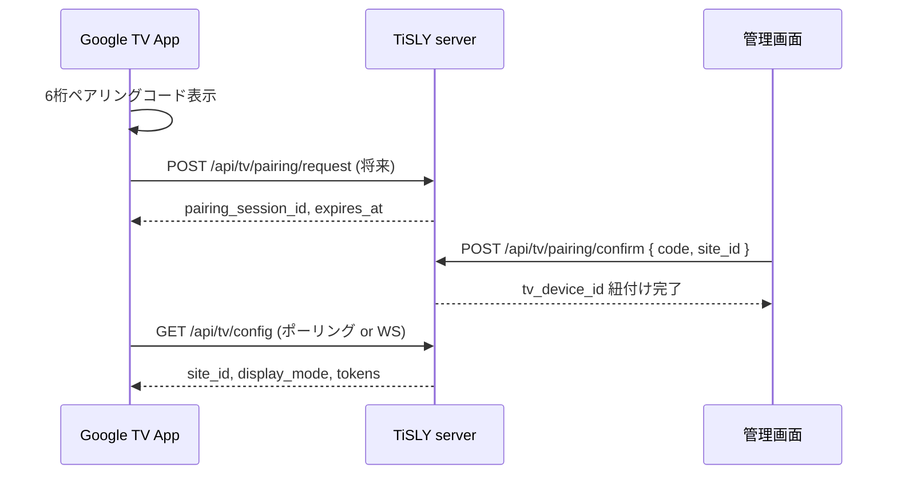

# Google TV ペアリング設計（Phase 101–120）

## 概要

TV 端末を **site_id** と **tv_device_id**（例: `TV-LOBBY-001`）に安全に紐付ける。  
**Phase 121–140 で API 実装済み**（`server/src/api/routes/tv.ts`）。

---

## フロー



---

## TV 側

1. 初回起動 → **設定 → ペアリング**
2. 画面に **6 桁コード** + QR（`https://tisly.jp/pair?code=XXXXXX` 将来）
3. コード有効期限: **10 分**（`pairing_expires_at`）
4. 紐付け完了までデモモード（ローカル WS のみ）可

---

## 管理画面側

1. 運用コンソール `/operations` → デバイス → TV 追加
2. 表示されたコードを入力
3. `site_id` を選択（例: `moriya-home`）
4. `tv_device_id` 自動採番 or 手入力（`TV-LOBBY-001`）

---

## データモデル（既存）

`tv_devices` テーブル:

- `device_id` — TV 論理 ID
- `site_id` — 拠点
- `pairing_code` — 一時コード（ハッシュ保存推奨・将来）
- `pairing_expires_at` — ISO8601
- `settings_json` — 表示モード、カメラ、サイネージ

---

## セキュリティ

| 対策 | 内容 |
|------|------|
| 期限付きコード | 10 分で失効、使い捨て |
| 試行回数制限 | 5 回失敗で 15 分ロック（将来） |
| 管理者認証 | ペアリング確定は admin ロールのみ |
| 不正登録防止 | コードは server 生成のみ、TV は表示のみ |
| tenant 分離 | 他テナントの site_id へ紐付け不可 |

---

## API（Phase 121–140）

| メソッド | パス | 説明 |
|----------|------|------|
| POST | `/api/tv/pairing/start` | TV が 6 桁コード発行（10 分有効） |
| POST | `/api/tv/pairing/confirm` | 管理画面がコード + site_id で確定 |
| GET | `/api/tv/devices` | TV 一覧 |
| PATCH | `/api/tv/devices/:id` | 設定更新 |
| DELETE | `/api/tv/devices/:id` | ペアリング解除 |
| POST | `/api/tv/devices/:id/test-alert` | TV テスト警報 |
| GET | `/api/tv/config/:deviceId` | TV 設定取得 |

---

## デモ代替（現状）

```bash
curl -X POST http://localhost:3080/api/test/tv-alert \
  -H "Content-Type: application/json" \
  -d '{"tvDeviceId":"TV-LOBBY-001","message":"ペアリング前デモ警報"}'
```

`tv-app`: `EXPO_PUBLIC_API_URL=http://<PC-IP>:3080`
