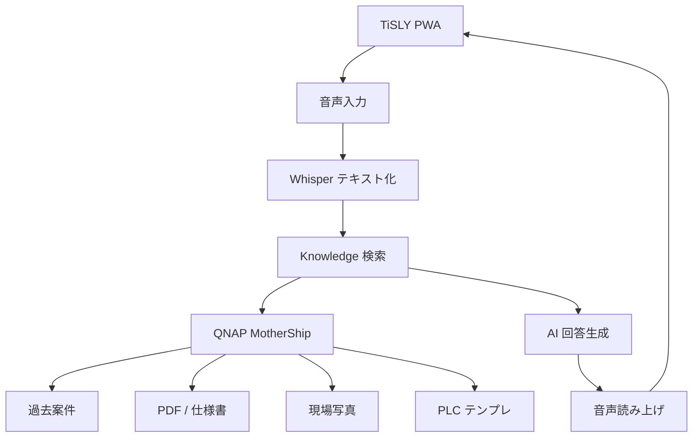

# TiSLY Knowledge — AI 検索ロードマップ

**最終更新:** 2026-06-21  
**現状:** v1 キーワード検索のみ。AI は未実装。

---

## 将来構想（音声 → 回答）

---

## フェーズ計画

| フェーズ | 内容 | 状態 |
|----------|------|------|
| **v1** | フォルダ構造 · Knowledge Card · キーワード検索 | ✅ 本 PR |
| **v2** | QNAP 同期ワーカー（KnowledgeCards → NAS） | 未着手 |
| **v3** | Qsirch / Document Center インデックス連携 | 調査中 → [qnap-ai-plan.md](./qnap-ai-plan.md) |
| **v4** | Whisper 音声入力（PWA / オフライン候補） | 未着手 |
| **v5** | RAG 回答（ローカル LLM or クラウド API） | 未着手 |
| **v6** | TTS 読み上げ · 現場ハンズフリー UX | 未着手 |

---

## v1 で整備した基盤

1. **Knowledge Card** — 最小検索単位（[knowledge-card-spec.md](./knowledge-card-spec.md)）
2. **SearchIndex** — `title` / `tags` / `summary` の JSON インデックス
3. **検索 API** — `GET /api/knowledge/search?q=`（`engine: keyword_v1`）
4. **登録 UI** — `/knowledge-v1`（ローカル `server/data/knowledge/`）

将来 AI 検索は **`knowledge-search-v1.ts`** の `searchKnowledgeIndexV1()` を差し替え可能な設計。

---

## データソース（将来）

| ソース | MotherShip パス | 用途 |
|--------|-----------------|------|
| 過去案件 | `Projects/` · `Documents/` | 類似工事の参照 |
| 仕様書 PDF | `Documents/.../specifications/` | 機器構成・IP |
| 現調写真 | `Photos/.../survey/` | 設置位置の視覚検索 |
| PLC テンプレ | `AI/Ladder/` · `PLC/` | 制御回路の回答 |
| 社内標準 | `AI/Standards/` · `Procedures/` | 手順・安全 |

**写真分離ルール維持:** 現調（survey）と完了報告（completion）は混在しない。

---

## 技術候補

| レイヤ | 候補 |
|--------|------|
| 音声認識 | OpenAI Whisper API · ブラウザ Web Speech API（フォールバック） |
| ベクトル検索 | QNAP Qsirch RAG · 外部 pgvector / sqlite-vec |
| LLM | QNAP AI Core（オンプレ）· OpenAI / Gemini（クラウド） |
| TTS | Web Speech Synthesis · Azure / Google TTS |

---

## 優先順位（推奨）

1. 人間が **Knowledge Card 10〜30 件** を手登録（現場で効くものから）
2. QNAP への Cards / SearchIndex 同期
3. Qsirch Workspace で AI フォルダを RAG 対象化
4. PWA から Whisper 入力プロトタイプ
5. RAG 回答 + 引用元 PDF リンク

---

## 残課題

- [ ] ベクトル embedding の保存形式（SearchIndex 拡張 vs Qsirch 委譲）
- [ ] 案件 ID と Knowledge Card の関連付けスキーマ
- [ ] オフライン PWA での Whisper（容量 · モデル配布）
- [ ] 回答の監査ログ（誰が何を聞いたか）
