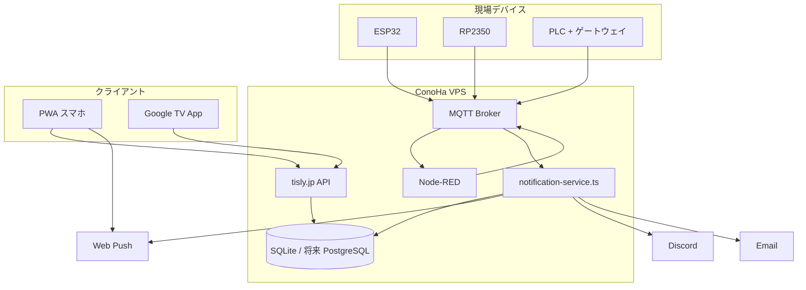

# TiSLY 通知アーキテクチャ

> **Phase 21–40** — ConoHa VPS + tisly.jp 統一

## 方針

| クライアント | 方式 |
|-------------|------|
| スマホ | PWA + Web Push |
| Google TV | Android TV ネイティブ (`tv-app/`) |
| ESP / RP2350 / PLC | 同一 MQTT → 通知基盤 |

**Node-RED は VPS 側のみ。** 通知配信はすべて **tisly.jp**（`server/notification/`）経由。

## 構成図

## 通知フロー

1. デバイスが MQTT でイベント / ハートビートを publish
2. `notification-service.ts` が subscribe → `event-processor` で判定
3. `platform_settings` に従いチャネル配信
4. `notification_logs` / `notification_queue` に記録
5. PWA・TV は `/api/notifications` で履歴参照

## Heartbeat

| 経過 | 状態 | イベント |
|------|------|----------|
| 30秒+ | warning | `heartbeat_warning` |
| 300秒+ | alarm | `heartbeat_alarm` |

`POST /api/heartbeat` または MQTT `heartbeat` で更新。

## 将来チャネル

LINE / Telegram / SMS — `notification/channels/` に追加予定。  
詳細: [FUTURE_NOTIFICATION_TODO.md](./FUTURE_NOTIFICATION_TODO.md)
