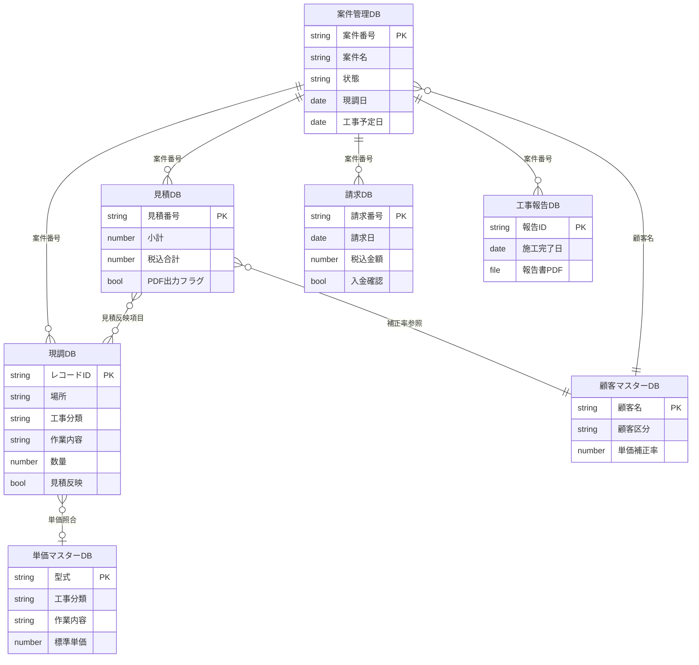
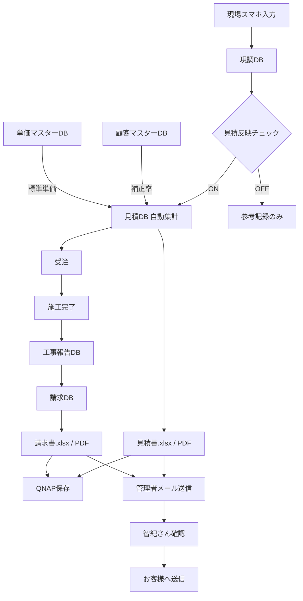
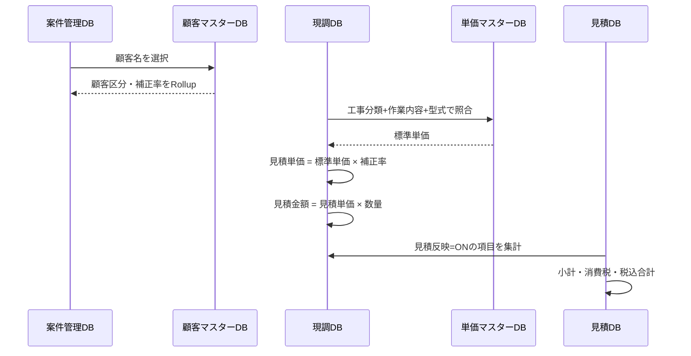
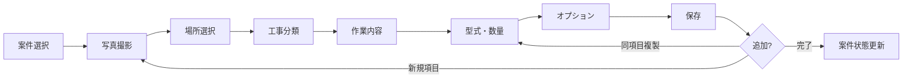

# TOMS Notion データベース設計書

> **TOMS** — 現調 → 見積 → 請求 自動化システム（Notion基盤）  
> 最終更新: 2026-05-31

---

## 1. 概要

本ドキュメントは、TOMS（現調・見積・請求一元管理）の Notion ワークスペースにおけるデータベース設計を定義する。

### 1.1 設計方針

| 方針 | 内容 |
|------|------|
| スマホ最優先 | 現調DBは現場入力を前提とした最小項目・大ボタンUI |
| マスター分離 | 顧客・単価はマスターDBで一元管理し、案件・見積は参照のみ |
| 関連の一方向性 | 案件管理DBをハブとし、下流DB（現調・見積・請求・工事報告）を関連付け |
| 将来拡張 | Excel/PDF自動生成・QNAP保存に必要な項目を初期段階から確保 |
| 自動送信禁止 | お客様へのメールは管理者確認後のみ（システム側でブロック） |

### 1.2 データベース一覧

| # | DB名 | 役割 | 主な入力端末 |
|---|------|------|-------------|
| ① | 案件管理DB | 案件のライフサイクル管理 | PC / スマホ |
| ② | 現調DB | 現場調査・工事項目入力 | **スマホ（最優先）** |
| ③ | 顧客マスターDB | 顧客情報・単価補正率 | PC |
| ④ | 単価マスターDB | 標準単価の参照 | PC |
| ⑤ | 見積DB | 見積書データ・PDF管理 | PC（自動生成） |
| ⑥ | 請求DB | 請求書データ・入金管理 | PC（自動生成） |
| ⑦ | 工事報告DB | 施工完了報告・写真 | スマホ / PC |

---

## 2. DB関連図

### 2.1 ER図（全体）



### 2.2 データフロー図



---

## 3. 各データベース詳細

### 3.1 ① 案件管理DB

案件の起点。すべての下流DBは本DBの「案件番号」に紐づく。

#### プロパティ定義

| プロパティ名 | Notion型 | 必須 | 説明・設定 |
|-------------|----------|------|-----------|
| 案件名 | **Title** | ○ | 案件の表示名（例: 土浦寮） |
| 案件番号 | **Unique ID** | ○ | 自動採番。プレフィックス `TOMS-`、形式 `TOMS-0001` |
| 顧客名 | **Relation** → 顧客マスターDB | ○ | 顧客選択。区分・補正率はRollupで取得 |
| 顧客区分 | **Rollup** | — | 顧客マスターDB → 顧客区分 |
| 単価補正率 | **Rollup** | — | 顧客マスターDB → 単価補正率 |
| 担当者 | **Select** または **Person** | ○ | TOMS担当者名 |
| 住所 | **Text** | ○ | 現場住所 |
| 電話番号 | **Phone** | △ | 顧客連絡先 |
| 現調日 | **Date** | △ | 現調実施日 |
| 工事予定日 | **Date** | △ | 施工予定日 |
| 状態 | **Select** | ○ | 下記選択肢。デフォルト: `現調前` |
| 現調 | **Relation** → 現調DB | — | 双方向関連 |
| 見積 | **Relation** → 見積DB | — | 双方向関連 |
| 請求 | **Relation** → 請求DB | — | 双方向関連 |
| 工事報告 | **Relation** → 工事報告DB | — | 双方向関連 |
| 備考 | **Text** | — | 社内メモ |
| 作成日時 | **Created time** | — | 自動 |
| 最終更新 | **Last edited time** | — | 自動 |

#### 状態（Select）選択肢

```
現調前 → 現調済 → 見積作成中 → 見積提出 → 受注 → 施工完了 → 請求済
```

#### ビュー構成（推奨）

| ビュー名 | 種類 | 用途 |
|---------|------|------|
| 全案件 | テーブル | PC管理用 |
| カンバン（状態別） | ボード | 進捗管理 |
| 今日の現調 | カレンダー | 現調日ベース |
| 未請求案件 | フィルター | 状態 ≠ 請求済 |
| スマホ概要 | ギャラリー | 案件名・状態のみ表示 |

---

### 3.2 ② 現調DB（スマホ入力最優先）

現場での入力速度を最優先。1レコード = 1工事項目。

#### プロパティ定義

| プロパティ名 | Notion型 | 必須 | 説明・設定 |
|-------------|----------|------|-----------|
| 項目名 | **Title** | ○ | 自動生成推奨（後述Formula） |
| 案件 | **Relation** → 案件管理DB | ○ | 双方向。案件番号をRollup |
| 案件番号 | **Rollup** | — | 案件管理DB → 案件番号 |
| 場所 | **Select** | ○ | 下記選択肢 |
| 工事分類 | **Select** | ○ | 下記選択肢 |
| 作業内容 | **Select** | ○ | 下記選択肢 |
| 型式・サイズ | **Text** | △ | 例: φ100, φ150, 75A, 20+2 |
| 数量 | **Number** | ○ | デフォルト: 1 |
| 既設撤去 | **Checkbox** | — | 既設品の撤去有無 |
| 高所作業 | **Checkbox** | — | 高所作業フラグ |
| 足場必要 | **Checkbox** | — | 足場必要フラグ |
| 備考 | **Text** | — | 長文入力可 |
| 写真 | **Files & media** | △ | 複数添付可。**写真先行入力を推奨** |
| 見積反映 | **Checkbox** | ○ | ON = 見積集計対象。デフォルト: ON |
| 標準単価 | **Rollup** または **Formula** | — | 単価マスター照合結果 |
| 見積単価 | **Formula** | — | `標準単価 × 補正率` |
| 見積金額 | **Formula** | — | `見積単価 × 数量` |
| 作成日時 | **Created time** | — | 自動 |

#### 場所（Select）選択肢

```
1階トイレ / 2階トイレ / 廊下 / 脱衣所 / 外壁 / 屋根裏 / 駐車場 / その他
```

#### 工事分類（Select）選択肢

```
換気 / 照明 / コンセント / スイッチ / 分電盤 / エアコン / 防犯カメラ / LAN / Wi-Fi / アンテナ / インターホン / EV / その他
```

#### 作業内容（Select）選択肢

```
交換 / 新設 / 撤去 / 移設 / 修理
```

#### 項目名 自動生成 Formula（推奨）

```
concat(
  prop("場所"), " / ",
  prop("工事分類"), " / ",
  prop("作業内容"),
  if(empty(prop("型式・サイズ")), "", " (" + prop("型式・サイズ") + ")")
)
```

#### スマホ向けビュー

| ビュー名 | 種類 | 設定 |
|---------|------|------|
| **現場入力** | フォーム | 案件・場所・工事分類・作業内容・数量・写真・見積反映 |
| 今日の入力 | リスト | 作成日 = 今日、案件番号グループ |
| 写真一覧 | ギャラリー | 写真プロパティをカバー表示 |
| 見積対象 | フィルター | 見積反映 = ON |

---

### 3.3 ③ 顧客マスターDB

#### プロパティ定義

| プロパティ名 | Notion型 | 必須 | 説明・設定 |
|-------------|----------|------|-----------|
| 顧客名 | **Title** | ○ | 正式名称（例: 株式会社伝元） |
| 顧客区分 | **Select** | ○ | 下記選択肢 |
| 単価補正率 | **Number** | ○ | 小数。例: 1.20 |
| 請求締日 | **Select** | △ | 例: 月末 / 20日 / 15日 |
| 支払条件 | **Text** | △ | 例: 翌月末払い |
| 備考 | **Text** | — | |
| 関連案件 | **Relation** → 案件管理DB | — | 双方向 |

#### 顧客区分と標準補正率

| 顧客区分 | 単価補正率（初期値） | 備考 |
|---------|-------------------|------|
| 一般 | 1.20 | 一般客向け |
| 管理会社 | 1.10 | 要個別設定 |
| 元請A | 1.00 | 基準単価 |
| 元請B | 0.90 | |
| 工務店 | 1.00 | 要個別設定 |
| 法人 | 1.15 | 要個別設定 |

> 補正率は顧客ごとに個別設定可能。上表は新規登録時のデフォルト推奨値。

---

### 3.4 ④ 単価マスターDB

#### プロパティ定義

| プロパティ名 | Notion型 | 必須 | 説明・設定 |
|-------------|----------|------|-----------|
| 型式 | **Title** | ○ | 型式・サイズ識別子 |
| 工事分類 | **Select** | ○ | 現調DBと同一選択肢 |
| 作業内容 | **Select** | ○ | 現調DBと同一選択肢 |
| 標準単価 | **Number** | ○ | 円（税抜） |
| 備考 | **Text** | — | |
| キー | **Formula** | — | `工事分類 + "_" + 作業内容 + "_" + 型式`（照合用） |

#### 初期データ例

| 工事分類 | 作業内容 | 型式 | 標準単価 |
|---------|---------|------|---------|
| 換気 | 交換 | φ100 | 55,000 |
| 換気 | 交換 | φ150 | 70,000 |
| 照明 | 交換 | シーリング | 8,000 |
| 照明 | 交換 | ダウンライト | 12,000 |
| コンセント | 新設 | 2口 | 15,000 |
| コンセント | 交換 | 2口 | 8,000 |
| スイッチ | 交換 | 1口 | 5,000 |
| 分電盤 | 交換 | 20+2 | 180,000 |
| エアコン | 交換 | 6畳 | 85,000 |
| 防犯カメラ | 新設 | 固定式 | 45,000 |
| LAN | 新設 | 1点 | 12,000 |
| Wi-Fi | 新設 | AP1台 | 35,000 |

---

### 3.5 ⑤ 見積DB

#### プロパティ定義

| プロパティ名 | Notion型 | 必須 | 説明・設定 |
|-------------|----------|------|-----------|
| 見積名 | **Title** | ○ | 例: 土浦寮_見積_20260531 |
| 見積番号 | **Unique ID** | ○ | プレフィックス `EST-`、形式 `EST-0001` |
| 案件 | **Relation** → 案件管理DB | ○ | 双方向 |
| 案件番号 | **Rollup** | — | |
| 顧客名 | **Rollup** | — | 案件 → 顧客名 |
| 顧客区分 | **Rollup** | — | 案件 → 顧客区分 |
| 補正率 | **Rollup** | — | 案件 → 単価補正率 |
| 工事項目 | **Relation** → 現調DB | ○ | 見積反映=ONの項目を関連 |
| 小計 | **Rollup** | ○ | 工事項目 → 見積金額、Calculate: Sum |
| 消費税 | **Formula** | ○ | `round(prop("小計") * 0.1)` |
| 税込合計 | **Formula** | ○ | `prop("小計") + prop("消費税")` |
| 作成日 | **Date** | ○ | 見積作成日 |
| PDF出力フラグ | **Checkbox** | — | PDF生成完了でON |
| 見積書PDF | **Files & media** | — | 生成PDFを添付 |
| 見積書xlsx | **Files & media** | — | 生成Excelを添付 |
| 管理者確認 | **Checkbox** | — | 智紀さん確認済みフラグ |
| お客様送信日 | **Date** | — | 手動記録（自動送信なし） |
| 備考 | **Text** | — | |

#### TOMS標準見積フォーマット連携用フィールド（将来）

| プロパティ名 | Notion型 | 用途 |
|-------------|----------|------|
| Excel転記ステータス | Select | 未転記 / 転記済 / エラー |
| 見積有効期限 | Date | Excel出力用 |
| 工期 | Text | Excel出力用 |
| 支払条件 | Rollup | 顧客マスターから |

---

### 3.6 ⑥ 請求DB

#### プロパティ定義

| プロパティ名 | Notion型 | 必須 | 説明・設定 |
|-------------|----------|------|-----------|
| 請求名 | **Title** | ○ | 例: 土浦寮_請求_20260630 |
| 請求番号 | **Unique ID** | ○ | プレフィックス `INV-`、形式 `INV-0001` |
| 案件 | **Relation** → 案件管理DB | ○ | 双方向 |
| 案件番号 | **Rollup** | — | |
| 見積 | **Relation** → 見積DB | △ | 元見積への参照 |
| 請求日 | **Date** | ○ | |
| 支払期限 | **Formula** または **Date** | ○ | 顧客マスターの支払条件から算出 |
| 請求金額 | **Number** | ○ | 税抜 |
| 消費税 | **Formula** | ○ | `round(prop("請求金額") * 0.1)` |
| 税込金額 | **Formula** | ○ | `prop("請求金額") + prop("消費税")` |
| 入金確認 | **Checkbox** | — | 入金済みでON |
| 入金日 | **Date** | — | |
| 請求書PDF | **Files & media** | — | |
| 請求書xlsx | **Files & media** | — | |
| 管理者確認 | **Checkbox** | — | |
| お客様送信日 | **Date** | — | 手動記録 |
| 備考 | **Text** | — | |

---

### 3.7 ⑦ 工事報告DB

案件管理DBの関連先として定義（将来拡張の基盤）。

#### プロパティ定義

| プロパティ名 | Notion型 | 必須 | 説明 |
|-------------|----------|------|------|
| 報告名 | **Title** | ○ | 例: 土浦寮_工事報告 |
| 案件 | **Relation** → 案件管理DB | ○ | |
| 施工完了日 | **Date** | ○ | |
| 施工担当者 | **Select** | ○ | |
| 作業内容概要 | **Text** | ○ | |
| 完了写真 | **Files & media** | △ | 複数可 |
| 報告書PDF | **Files & media** | — | 将来自動生成 |
| 顧客確認 | **Checkbox** | — | 署名・確認済み |
| 備考 | **Text** | — | |

---

## 4. 単価システム

### 4.1 補正率の取得フロー



### 4.2 計算式

```
見積単価 = 標準単価 × 単価補正率
見積金額 = 見積単価 × 数量
小計   = Σ(見積金額)  ※見積反映=ON の項目のみ
消費税 = round(小計 × 0.10)
税込合計 = 小計 + 消費税
```

### 4.3 計算例

| 項目 | 値 |
|------|-----|
| 顧客 | 株式会社伝元（一般） |
| 補正率 | 1.20 |
| 工事 | 換気 交換 φ100 × 2 |
| 標準単価 | 55,000円 |
| 見積単価 | 55,000 × 1.20 = **66,000円** |
| 見積金額 | 66,000 × 2 = **132,000円** |

---

## 5. スマホ入力画面イメージ

### 5.1 画面遷移



### 5.2 画面モックアップ（ASCII）

#### 画面1: 案件選択

```
┌─────────────────────────────┐
│  TOMS 現場入力         ≡   │
├─────────────────────────────┤
│                             │
│  今日の案件を選択            │
│                             │
│  ┌─────────────────────┐   │
│  │ 📋 土浦寮            │   │
│  │    伝元 / 現調済     │   │
│  └─────────────────────┘   │
│                             │
│  ┌─────────────────────┐   │
│  │ 📋 ○○マンション      │   │
│  │    ○○管理 / 現調前   │   │
│  └─────────────────────┘   │
│                             │
│  ┌─────────────────────┐   │
│  │  ＋ 新規案件作成      │   │
│  └─────────────────────┘   │
│                             │
└─────────────────────────────┘
```

#### 画面2: 写真先行入力

```
┌─────────────────────────────┐
│  ← 土浦寮                   │
├─────────────────────────────┤
│                             │
│  📷 まず写真を撮影           │
│                             │
│  ┌───────┐ ┌───────┐       │
│  │       │ │       │       │
│  │ 📷+   │ │  img  │       │
│  │       │ │   1   │       │
│  └───────┘ └───────┘       │
│                             │
│  ┌─────────────────────┐   │
│  │   📷  写真を追加      │   │  ← 大ボタン
│  └─────────────────────┘   │
│                             │
│  ┌─────────────────────┐   │
│  │   次へ →             │   │
│  └─────────────────────┘   │
│                             │
└─────────────────────────────┘
```

#### 画面3: 工事項目入力（メイン）

```
┌─────────────────────────────┐
│  ← 項目 1/3                 │
├─────────────────────────────┤
│                             │
│  場所                        │
│  ┌──────┐┌──────┐┌──────┐  │
│  │1Fﾄｲﾚ││2Fﾄｲﾚ││ 廊下 │  │  ← タップ選択
│  └──────┘└──────┘└──────┘  │
│  ┌──────┐┌──────┐┌──────┐  │
│  │脱衣所││ 外壁 ││その他│  │
│  └──────┘└──────┘└──────┘  │
│                             │
│  工事分類                    │
│  ┌──────┐┌──────┐┌──────┐  │
│  │ 換気 ││ 照明 ││ｺﾝｾﾝﾄ│  │
│  └──────┘└──────┘└──────┘  │
│                             │
│  作業内容                    │
│  ┌──────┐┌──────┐┌──────┐  │
│  │ 交換 ││ 新設 ││ 撤去 │  │
│  └──────┘└──────┘└──────┘  │
│                             │
│  型式・サイズ  ┌──────────┐ │
│              │ φ100     │ │  ← 音声入力可
│              └──────────┘ │
│                             │
│  数量  ┌───┐               │
│       │ 1 │ ＋  −         │
│       └───┘               │
│                             │
│  ☐ 既設撤去  ☐ 高所作業     │
│  ☐ 足場必要  ☑ 見積反映     │
│                             │
│  備考 ┌──────────────────┐ │
│      │                  │ │
│      └──────────────────┘ │
│                             │
│  ┌──────────┐┌──────────┐  │
│  │ 複製保存  ││  保存    │  │
│  └──────────┘└──────────┘  │
│                             │
└─────────────────────────────┘
```

#### 画面4: 入力完了

```
┌─────────────────────────────┐
│  ✓ 保存しました              │
├─────────────────────────────┤
│                             │
│  土浦寮 - 入力項目: 3件      │
│                             │
│  1. 1Fトイレ / 換気 / 交換   │
│     φ100 × 1               │
│                             │
│  2. 2Fトイレ / 換気 / 交換   │
│     φ100 × 1               │
│                             │
│  3. 廊下 / 照明 / 交換       │
│     シーリング × 2          │
│                             │
│  ┌─────────────────────┐   │
│  │  ＋ 項目を追加        │   │
│  └─────────────────────┘   │
│                             │
│  ┌─────────────────────┐   │
│  │  現調完了にする       │   │  → 案件状態を「現調済」に
│  └─────────────────────┘   │
│                             │
└─────────────────────────────┘
```

### 5.3 スマホUI設計原則

| 原則 | 実装方法 |
|------|---------|
| 片手入力 | 主要操作を画面下部に配置。ボタン高さ 48px 以上 |
| 写真先行 | 入力フローの最初に写真撮影ステップを配置 |
| 大きなボタン | Notionフォーム + 選択肢はSelect型でタップ数最小化 |
| 3分以内 | 必須項目は5つ（場所・分類・作業・数量・写真）。型式は音声入力 |
| 同項目複製 | 前回入力値を保持したまま数量のみ変更して再保存 |
| 音声入力 | 型式・サイズ・備考はText型（OS標準音声入力が使える） |

### 5.4 Notionフォーム設定（現場入力ビュー）

```
フォーム名: TOMS 現場入力
送信先: 現調DB

表示順:
  1. 案件（Relation・必須）
  2. 写真（Files・任意）      ← 最上部に配置
  3. 場所（Select・必須）
  4. 工事分類（Select・必須）
  5. 作業内容（Select・必須）
  6. 型式・サイズ（Text・任意）
  7. 数量（Number・必須・初期値1）
  8. 既設撤去（Checkbox）
  9. 高所作業（Checkbox）
  10. 足場必要（Checkbox）
  11. 見積反映（Checkbox・初期値ON）
  12. 備考（Text・任意）
```

---

## 6. QNAP 保存構成

```
QNAP/
└── TOMS/
    └── {顧客名}/
        └── {案件名}/
            ├── 現調写真/
            │   ├── 20260531_1Fトイレ_001.jpg
            │   └── 20260531_2Fトイレ_001.jpg
            ├── 見積書.xlsx
            ├── 見積書.pdf
            ├── 請求書.xlsx
            ├── 請求書.pdf
            └── 工事報告書.pdf
```

### Notion との対応

| QNAPパス | Notionソース |
|---------|-------------|
| 現調写真/ | 現調DB → 写真 |
| 見積書.xlsx | 見積DB → 見積書xlsx |
| 見積書.pdf | 見積DB → 見積書PDF |
| 請求書.xlsx | 請求DB → 請求書xlsx |
| 請求書.pdf | 請求DB → 請求書PDF |
| 工事報告書.pdf | 工事報告DB → 報告書PDF |

---

## 7. Notion ワークスペース構成（推奨）

```
TOMS ワークスペース
├── 📊 ダッシュボード（今日の現調・未請求・進行中案件）
├── 📁 案件管理
│   └── 案件管理DB
├── 📁 現場入力（スマホブックマーク先）
│   └── 現調DB（フォームビュー）
├── 📁 見積・請求
│   ├── 見積DB
│   └── 請求DB
├── 📁 マスター
│   ├── 顧客マスターDB
│   └── 単価マスターDB
└── 📁 工事報告
    └── 工事報告DB
```

---

## 8. 命名規則

| 対象 | 形式 | 例 |
|------|------|-----|
| 案件番号 | TOMS-XXXX | TOMS-0042 |
| 見積番号 | EST-XXXX | EST-0015 |
| 請求番号 | INV-XXXX | INV-0008 |
| 見積ファイル | {案件名}_見積_{YYYYMMDD} | 土浦寮_見積_20260531 |
| 請求ファイル | {案件名}_請求_{YYYYMMDD} | 土浦寮_請求_20260630 |
| 写真ファイル | {YYYYMMDD}_{場所}_{連番}.jpg | 20260531_1Fトイレ_001.jpg |

---

## 9. 権限設計（推奨）

| ロール | 案件管理 | 現調 | 見積 | 請求 | マスター |
|--------|---------|------|------|------|---------|
| 管理者（智紀さん） | 編集 | 編集 | 編集 | 編集 | 編集 |
| 現場担当 | 閲覧 | **編集** | 閲覧 | — | 閲覧 |
| 経理 | 閲覧 | 閲覧 | 閲覧 | **編集** | 閲覧 |

---

## 10. 関連ドキュメント

- [notion_phase1_5.md](./notion_phase1_5.md) — **Phase 1.5** 運用拡張（見積ライブラリ・写真管理・ダッシュボード）
- [estimate_library.md](./estimate_library.md) — 見積ライブラリDB
- [photo_management.md](./photo_management.md) — 工事写真管理DB
- [customer_management.md](./customer_management.md) — 顧客マスター強化
- [dashboard_design.md](./dashboard_design.md) — 営業ダッシュボード
- [workflow.md](./workflow.md) — 業務フロー・運用マニュアル
- [future_roadmap.md](./future_roadmap.md) — 将来拡張ロードマップ
