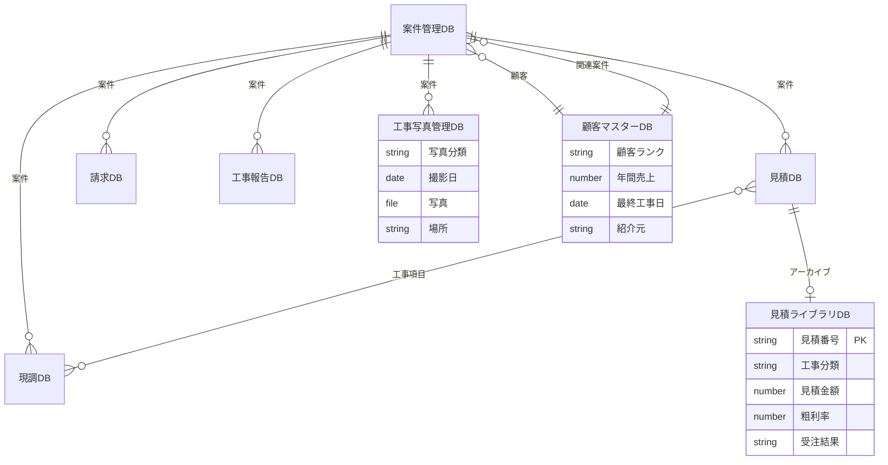

# TOMS Notion Phase 1.5 — 運用システム拡張

> **TOMS** — 現調 → 見積 → 請求 自動化システム（Notion基盤）  
> Phase 1.5: DB設計から「毎日使える運用システム」へ  
> 最終更新: 2026-05-31

---

## 1. Phase 1.5 の目的

Phase 1 では Notion 上に 7 つの DB を設計し、手動運用の基盤を整えた。  
**Phase 1.5** では、それを「設計書」から **TOMS で毎日使える運用システム** へ発展させる。

| 観点 | Phase 1 | Phase 1.5 |
|------|---------|-----------|
| 位置づけ | DB設計・手動運用 | 検索・写真・ダッシュボード・案件ハブ |
| 入力目標 | 現調 3 分以内 | **案件作成〜保存 60 秒以内** |
| 見積 | 案件ごとに都度作成 | **過去見積を検索・参照** |
| 写真 | 現調DBに添付 | **工程別に一元管理** |
| 顧客 | 区分・補正率のみ | **ランク・売上・紹介元など強化** |
| 画面 | DBごとに分散 | **案件トップで一画面表示** |

### 1.1 Phase 1.5 完了後にできること

```
現調
  ↓
Notion入力（60秒フロー）
  ↓
写真保存（工程別）
  ↓
過去見積検索
  ↓
見積作成
```

### 1.2 Phase 2 への接続（推奨ロードマップ）

Phase 1.5 完了後、次の Phase 2 へ進むのが最適な順序である。

```
Notion（Phase 1.5 運用データ）
  ↓
Excel 自動生成
  ↓
PDF
  ↓
QNAP 保存
  ↓
智紀さんの仕事用メールへ通知
```

> Phase 1.5 でデータ構造と運用フローを固めてから自動化に入ることで、  
> Phase 2 の Excel/PDF 生成・QNAP 連携がスムーズに実装できる。

---

## 2. Phase 1.5 追加・変更一覧

| # | 名称 | 種別 | ドキュメント |
|---|------|------|-------------|
| ① | 見積ライブラリDB | **新規 DB** | [estimate_library.md](./estimate_library.md) |
| ② | 工事写真管理DB | **新規 DB** | [photo_management.md](./photo_management.md) |
| ③ | 顧客マスター強化 | **既存 DB 拡張** | [customer_management.md](./customer_management.md) |
| ④ | 営業ダッシュボード | **新規ページ** | [dashboard_design.md](./dashboard_design.md) |
| ⑤ | 案件トップページ | **新規ページ** | 本ドキュメント §5 |
| ⑥ | スマホ 60 秒フロー | **UI 改善** | 本ドキュメント §6 |

### 2.1 拡張後の DB 一覧（Phase 1 + 1.5）

| # | DB名 | Phase |
|---|------|-------|
| ① | 案件管理DB | 1 |
| ② | 現調DB | 1 |
| ③ | 顧客マスターDB | 1 → **1.5 強化** |
| ④ | 単価マスターDB | 1 |
| ⑤ | 見積DB | 1 |
| ⑥ | 請求DB | 1 |
| ⑦ | 工事報告DB | 1 |
| ⑧ | **見積ライブラリDB** | **1.5 新規** |
| ⑨ | **工事写真管理DB** | **1.5 新規** |

---

## 3. 全体関連図（Phase 1.5）



---

## 4. 構築順序（推奨）

Notion 初心者でも迷わないよう、以下の順番で構築する。

| 順番 | 作業 | 所要目安 | 参照 |
|------|------|---------|------|
| 1 | 顧客マスターに項目追加 | 20 分 | [customer_management.md](./customer_management.md) |
| 2 | 工事写真管理DB 新規作成 | 30 分 | [photo_management.md](./photo_management.md) |
| 3 | 見積ライブラリDB 新規作成 | 30 分 | [estimate_library.md](./estimate_library.md) |
| 4 | 案件管理DB に Relation 追加 | 15 分 | 本ドキュメント §5 |
| 5 | 案件トップページ作成 | 45 分 | 本ドキュメント §5 |
| 6 | 営業ダッシュボード作成 | 45 分 | [dashboard_design.md](./dashboard_design.md) |
| 7 | スマホ 60 秒フォーム設定 | 30 分 | 本ドキュメント §6 |
| 8 | 既存データ移行（任意） | 60 分 | 各ドキュメント末尾 |

**合計目安: 約 4 時間**（初回構築）

---

## 5. 案件トップページ（追加DB⑤）

### 5.1 目的

案件を開くと、以下が **1 画面（1 ページ）** で縦に並んで見える構造にする。

```
案件情報
  ↓
現調
  ↓
写真
  ↓
見積
  ↓
工事報告
  ↓
請求
```

### 5.2 ページ構成イメージ

```
┌─────────────────────────────────────────┐
│  📋 土浦寮  TOMS-0042  状態: 現調済      │
├─────────────────────────────────────────┤
│  【案件情報】                            │
│  顧客: 株式会社伝元  担当: 智紀          │
│  住所: ○○県○○市...  現調日: 2026/05/31  │
├─────────────────────────────────────────┤
│  【現調】  3件                           │
│  ┌ 1Fトイレ / 換気 / 交換 φ100         │
│  ┌ 2Fトイレ / 換気 / 交換 φ100         │
│  └ 廊下 / 照明 / 交換 シーリング×2     │
├─────────────────────────────────────────┤
│  【写真】  8枚                           │
│  [現調×3] [施工前×2] [完成×3]           │
├─────────────────────────────────────────┤
│  【見積】  EST-0015  ¥198,000（税込）    │
├─────────────────────────────────────────┤
│  【工事報告】  —                         │
├─────────────────────────────────────────┤
│  【請求】  —                             │
└─────────────────────────────────────────┘
```

### 5.3 構築手順（Notion 操作詳細）

#### Step 1: 案件管理DB に Relation を追加

1. 左サイドバー → **案件管理** フォルダ → **案件管理DB** を開く
2. テーブル右上 **「＋」**（プロパティ追加）をクリック
3. 以下を追加:

| 追加プロパティ | 操作 |
|--------------|------|
| 工事写真 | **Relation** → 「工事写真管理DB」を選択 → **双方向** を ON |
| 見積ライブラリ | **Relation** → 「見積ライブラリDB」を選択 → **双方向** を ON |

> 現調・見積・請求・工事報告の Relation は Phase 1 で設定済み。

#### Step 2: 案件テンプレートページを作成

1. 案件管理DB の任意の行を **右クリック** → **新規ページ**（または行をクリックしてページを開く）
2. ページ上部に **見出し1** を追加 → `{{案件名}}` の代わりに案件名プロパティを表示
   - 入力: `/linked` → **Linked database property** → 案件名
3. 以下の順に **見出し2** と **Linked database** を追加:

| 順番 | 見出し2 | Linked database 設定 |
|------|---------|---------------------|
| 1 | 案件情報 | プロパティ一覧（案件番号・顧客名・状態・住所・担当者・現調日） |
| 2 | 現調 | データソース: 現調DB / フィルター: 案件 = このページ |
| 3 | 写真 | データソース: 工事写真管理DB / フィルター: 案件 = このページ / 表示: ギャラリー |
| 4 | 見積 | データソース: 見積DB / フィルター: 案件 = このページ |
| 5 | 工事報告 | データソース: 工事報告DB / フィルター: 案件 = このページ |
| 6 | 請求 | データソース: 請求DB / フィルター: 案件 = このページ |

#### Step 3: Linked database の追加方法（詳細）

1. ページ内で `/linked` と入力 → **Linked view of database** を選択
2. 検索欄に DB 名（例: `現調`）を入力 → 選択
3. リンクされた DB ブロック右上 **「⋯」** → **Filter**
4. **Add filter** → プロパティ `案件` → **Contains** → **このページ**（Current page）
5. 写真セクションは **Layout** → **Gallery** を選択

#### Step 4: テンプレートボタン化

1. 完成した案件ページを **テンプレート** として複製可能にする:
   - 案件管理DB 右上 **「⋯」** → **Templates** → **New template**
   - テンプレート名: `案件トップ（標準）`
   - Step 2〜3 の構成をテンプレート内にコピー
2. 新規案件作成時: **New** → **案件トップ（標準）** を選択

#### Step 5: 案件一覧からワンクリックで開く

1. 案件管理DB の **全案件** ビュー
2. 列 `案件名` をクリックすると案件トップページが開く
3. スマホ用 **ギャラリービュー** を追加:
   - **＋ Add a view** → **Gallery**
   - 表示: 案件名・状態・顧客名
   - カードサイズ: Medium

---

## 6. スマホ UI 改善 — 60 秒フロー

### 6.1 目標

```
案件作成 → 写真撮影 → 現調入力 → 保存
```

を **60 秒以内** で完了できる設計。

| ステップ | 目標時間 | 操作数 |
|---------|---------|--------|
| 案件作成（既存選択 or 新規） | 10 秒 | 2 タップ |
| 写真撮影 | 15 秒 | 1〜2 タップ |
| 現調入力（最小項目） | 30 秒 | 5 タップ |
| 保存 | 5 秒 | 1 タップ |
| **合計** | **60 秒** | **9〜10 タップ** |

### 6.2 Phase 1 からの変更点

| 項目 | Phase 1 | Phase 1.5 |
|------|---------|-----------|
| 必須入力 | 場所・分類・作業・数量・写真 | **場所・分類・作業・数量**（写真は推奨） |
| 写真保存先 | 現調DB のみ | **工事写真管理DB にも自動連携** |
| フォーム数 | 1 つ | **クイック入力** + 詳細入力の 2 段階 |
| 案件作成 | PC 事前登録 | **スマホから最小項目で新規作成可** |

### 6.3 クイック入力フォーム設定手順

#### Step 1: 現調DB に「クイック入力」ビューを作成

1. **現調DB** を開く
2. 左上ビュー名横 **「＋ Add a view」**
3. 種類: **Form** → 名前: `TOMS クイック入力（60秒）`

#### Step 2: フォーム項目（最小構成）

表示順を以下に設定（フォーム編集画面で **ドラッグ** で並べ替え）:

| 順 | プロパティ | 必須 | 初期値 |
|----|-----------|------|--------|
| 1 | 案件 | ○ | — |
| 2 | 写真 | △ | — |
| 3 | 場所 | ○ | — |
| 4 | 工事分類 | ○ | — |
| 5 | 作業内容 | ○ | — |
| 6 | 数量 | ○ | **1** |

非表示にする項目: 型式・サイズ、既設撤去、高所作業、足場必要、備考（詳細入力フォーム側へ）

#### Step 3: 案件の新規作成フォーム（スマホ用）

1. **案件管理DB** → **＋ Add a view** → **Form**
2. 名前: `TOMS 案件クイック作成`
3. 表示項目:

| プロパティ | 必須 |
|-----------|------|
| 案件名 | ○ |
| 顧客名 | ○ |
| 住所 | ○ |
| 担当者 | ○ |
| 状態 | 非表示（デフォルト `現調前`） |

#### Step 4: 写真を工事写真管理DB にも保存（運用ルール）

60 秒フローでは自動連携（Phase 2）まで、以下の **手動ルール** で運用:

1. クイック入力フォームで写真を添付 → 現調DB に保存
2. 週 1 回、または現調完了時に **工事写真管理DB** へ一括登録
   - 写真分類: `現調`
   - 案件: 該当案件を選択
   - 写真: 現調DB からコピー

> Phase 2 で Notion Automation により現調保存時に工事写真管理DB へ自動複製予定。

#### Step 5: スマホホーム画面への追加

1. スマホブラウザ or Notion アプリで `TOMS クイック入力（60秒）` フォームを開く
2. **共有** → **ホーム画面に追加**
3. 同様に `TOMS 案件クイック作成` も追加

### 6.4 60 秒フロー操作手順（現場担当者向け）

```
① ホーム画面「TOMS クイック入力」をタップ        … 3秒
② 案件を選択（一覧から1タップ）                  … 5秒
③ 📷 写真を1枚撮影                              … 15秒
④ 場所 → 工事分類 → 作業内容 をタップ選択       … 20秒
⑤ 数量は初期値1のまま                          … 0秒
⑥ 「Submit」/「送信」                           … 5秒
⑦ 保存確認                                      … 2秒
────────────────────────────────────────────
  合計 約 50 秒（余裕 10 秒）
```

---

## 7. ワークスペース構成（Phase 1.5 版）

```
TOMS ワークスペース
├── 📊 営業ダッシュボード          ← Phase 1.5 新規
├── 📁 案件管理
│   ├── 案件管理DB
│   └── 案件トップ（テンプレート）
├── 📁 現場入力（スマホブックマーク）
│   ├── 現調DB（クイック入力フォーム）  ← 60秒版
│   ├── 現調DB（詳細入力フォーム）
│   └── 工事写真管理DB              ← Phase 1.5 新規
├── 📁 見積・請求
│   ├── 見積DB
│   ├── 見積ライブラリDB            ← Phase 1.5 新規
│   └── 請求DB
├── 📁 マスター
│   ├── 顧客マスターDB（強化版）
│   └── 単価マスターDB
└── 📁 工事報告
    └── 工事報告DB
```

---

## 8. 成功基準（Phase 1.5）

- [ ] 過去見積を工事分類・顧客名で検索できる
- [ ] 案件ごとに現調/施工前/施工後/完成の写真が分類されている
- [ ] 顧客マスターにランク・年間売上・最終工事日が表示される
- [ ] 営業ダッシュボードで今月の見積件数・受注件数・売上が確認できる
- [ ] 案件を開くと現調〜請求まで 1 ページで見える
- [ ] スマホから 60 秒以内で現調 1 件を入力できる

---

## 9. 関連ドキュメント

| ドキュメント | 内容 |
|-------------|------|
| [estimate_library.md](./estimate_library.md) | 見積ライブラリDB 詳細・構築手順 |
| [photo_management.md](./photo_management.md) | 工事写真管理DB 詳細・構築手順 |
| [customer_management.md](./customer_management.md) | 顧客マスター強化・構築手順 |
| [dashboard_design.md](./dashboard_design.md) | 営業ダッシュボード 設計・構築手順 |
| [notion_database_design.md](./notion_database_design.md) | Phase 1 DB 設計（基盤） |
| [workflow.md](./workflow.md) | 業務フロー・運用マニュアル |
| [future_roadmap.md](./future_roadmap.md) | Phase 2 以降のロードマップ |
