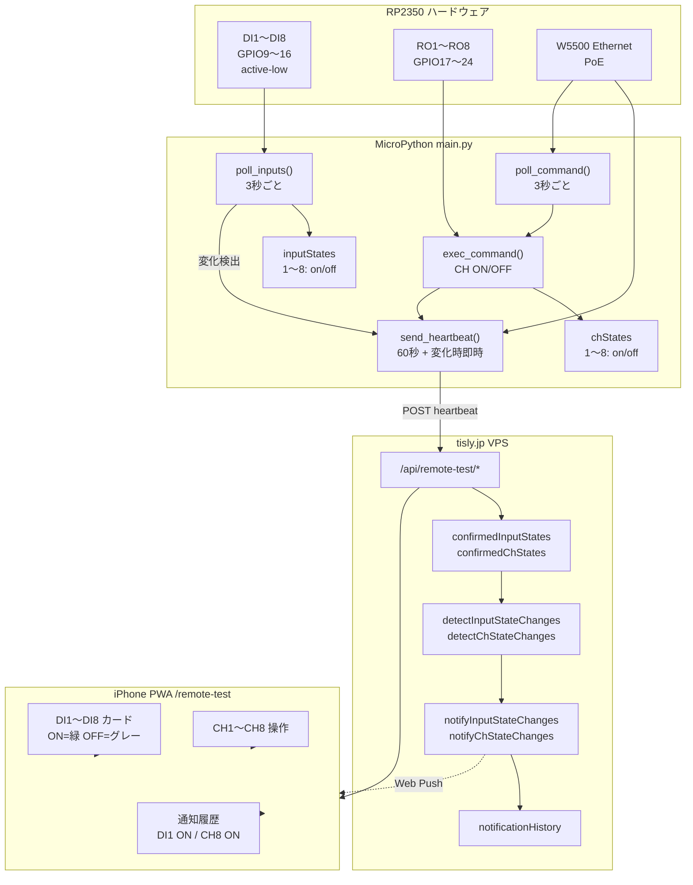
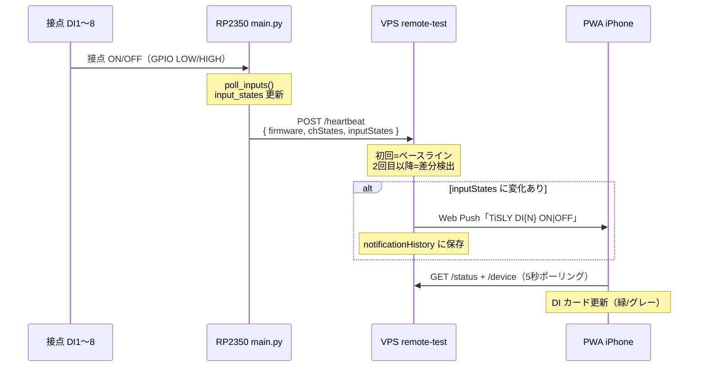

# Phase6 — 8DI 構成図

**ファームウェア版:** `1.4.0-remote-test-phase6`  
**対象ボード:** Waveshare RP2350-POE-ETH-8DI-8RO  
**目的:** DI1〜DI8 の状態取得・heartbeat 送信・差分通知・PWA 表示  
**拡張:** Security Demo Mode — [`security-demo-mode.md`](security-demo-mode.md)

---

## システム構成



---

## データフロー（DI 変化時）



---

## GPIO マッピング

| 論理 | GPIO | 極性 | 備考 |
|------|------|------|------|
| DI1 | GP9 | active-low | 接点 ON = LOW → `"on"` |
| DI2 | GP10 | active-low | |
| DI3 | GP11 | active-low | |
| DI4 | GP12 | active-low | |
| DI5 | GP13 | active-low | |
| DI6 | GP14 | active-low | |
| DI7 | GP15 | active-low | |
| DI8 | GP16 | active-low | |
| RO1 (CH1) | GP17 | — | 既存 Phase5 |
| … | … | … | |
| RO8 (CH8) | GP24 | — | |

---

## heartbeat ペイロード

```json
{
  "firmware": "1.4.0-remote-test-phase6",
  "chStates": {
    "1": "off", "2": "off", "3": "off", "4": "off",
    "5": "off", "6": "off", "7": "off", "8": "off"
  },
  "inputStates": {
    "1": "off", "2": "off", "3": "off", "4": "off",
    "5": "off", "6": "off", "7": "off", "8": "off"
  }
}
```

---

## 差分検出ルール

| 種別 | ベースラインキー | 通知ラベル例 |
|------|------------------|--------------|
| リレー出力 | `deviceChStatesBaselined` | `CH8 ON` |
| デジタル入力 | `deviceInputStatesBaselined` | `DI1 OFF` |

1. **初回 heartbeat** — 各種別ごとにベースライン確立のみ（通知なし）
2. **2 回目以降** — `confirmed*States` と比較し OFF→ON / ON→OFF のみ通知
3. **同一状態の連続 heartbeat** — 通知しない

---

## 実装ファイル

| 層 | ファイル | 内容 |
|----|----------|------|
| ファーム | `rp2350/firmware/main.py` | `input_states`, `poll_inputs()`, heartbeat 拡張 |
| ファーム | `rp2350/firmware/config.py` | `DI_GPIO`, `DI_ACTIVE_LOW` |
| サーバー | `server/src/remote-test/remote-test-state.ts` | `confirmedInputStates`, 差分検出 |
| サーバー | `server/src/remote-test/remote-test-ch-notify.ts` | `notifyInputStateChanges()` |
| サーバー | `server/src/api/routes/remote-test.ts` | heartbeat `inputStates` 受信 |
| PWA | `server/public/remote-test.html` | DI1〜DI8 カード |
| PWA | `server/public/js/remote-test.js` | `renderInputBadge()` |
| テスト | `server/test/remote-test.test.ts` | DI 通知ユニットテスト |
| テスト | `rp2350/test/device_verify_di_test.py` | DI1/4/8 ON/OFF 検証 |

---

## テスト手順

### 自動（サーバー）

```bash
cd server && npm test -- test/remote-test.test.ts
```

### 統合（VPS 向け heartbeat シミュレーション）

```bash
cd rp2350/test && python device_verify_di_test.py
```

### 実機

1. `main.py` + `config.py` を RP2350 にデプロイ（fw `1.4.0-remote-test-phase6`）
2. PWA で Push 登録済みであることを確認
3. DI1 / DI4 / DI8 の接点を ON → OFF と操作
4. PWA「デジタル入力状態」カードと「通知履歴」で `DI1 ON` / `DI1 OFF` 等を確認

---

## 完了条件

- [x] `inputStates` をファーム・サーバー・PWA で一貫管理
- [x] heartbeat に `inputStates` を含める
- [x] DI 変化で Web Push + `notificationHistory` 記録
- [x] PWA に DI1〜DI8 リアルタイム表示（ON=緑 / OFF=グレー）
- [x] DI1 / DI4 / DI8 の ON/OFF 通知テスト
