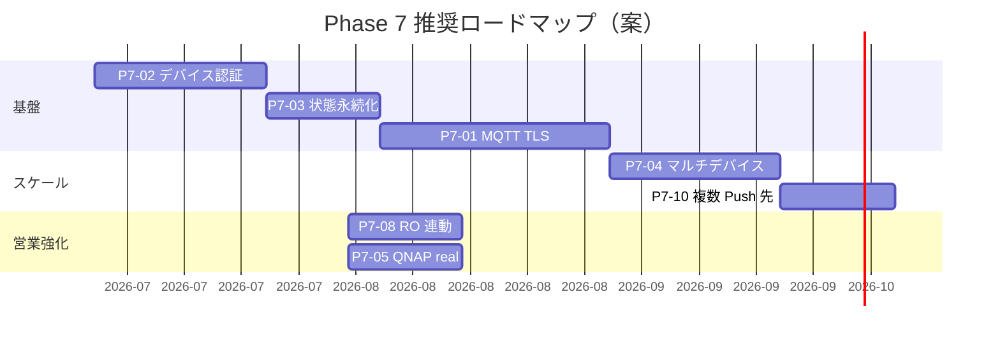

# TiSLY Lite — Phase 7 候補一覧

**作成日:** 2026-06-08  
**前提:** TiSLY Lite RC1 Freeze（`rc1-lite-demo`）完了  
**方針:** RC1 では新機能追加を停止。以下は Phase 7 以降の検討候補である。

---

## 優先度の見方

| 記号 | 意味 |
|------|------|
| 🔴 高 | 本番導入・スケールに必須 |
| 🟡 中 | 営業力・運用効率の向上 |
| 🟢 低 | 別ライン・長期 |

---

## 候補一覧

| # | 候補 | 優先度 | 概要 | RC1 との関係 |
|---|------|--------|------|--------------|
| P7-01 | **MQTT TLS 本格移行** | 🔴 | HTTP poll/heartbeat を廃止し、双方向 MQTT + TLS | RC1 の最大技術的負債 |
| P7-02 | **デバイス個別認証** | 🔴 | 共有トークン → JWT / クライアント証明書 per device | セキュリティ必須 |
| P7-03 | **サーバー状態永続化** | 🔴 | `confirmedChStates`・命令キューを Redis/DB 化 | VPS 再起動耐性 |
| P7-04 | **マルチデバイス** | 🟡 | 複数 RP2350 / 拠点 ID・テナント分離 | 営業「1 台のみ」制限の解消 |
| P7-05 | **QNAP イベントアーカイブ連携** | 🟡 | 侵入イベントの NAS 保存・営業デモ実 NAS | mock → real |
| P7-06 | **オフライン検知の高速化** | 🟡 | heartbeat 60s / offline 90s の短縮 or MQTT keepalive | デモの体感改善 |
| P7-07 | **Node-RED フロー統合** | 🟡 | `tisly_home_v1.json` / `tisly_rp2350_v1.json` と Remote Test 統合 | ローカル LAN デモ |
| P7-08 | **RO 連動シナリオ** | 🟡 | 侵入時 RO1/RO2 自動 ON（盤内ロジック or サーバー） | デモのインパクト向上 |
| P7-09 | **スケジュール警戒** | 🟡 | 時刻指定 ARM（夜間のみ等） | 住宅・店舗向け |
| P7-10 | **複数 PWA ユーザー** | 🟡 | 家族・スタッフ複数端末への Push 振り分け | 商用必須に近い |
| P7-11 | **Android / デスクトップ PWA 最適化** | 🟢 | iPhone 以外の QA・UI 調整 | 営業デバイス拡張 |
| P7-12 | **OTA ファームウェア更新** | 🟢 | Thonny 手動からの脱却 | 製造・量産フェーズ |
| P7-13 | **Pro Remote 統合** | 🟢 | `/customer/*/pro-remote` とのライブ連携 | 別プロダクトライン |
| P7-14 | **Google TV ミラー** | 🟢 | 侵入時 TV 全画面アラート | `/sales` デモ拡張 |
| P7-15 | **多言語 UI（EN/中文）** | 🟢 | PWA 文言の i18n | 海外展示 |
| P7-16 | **監査ログ・コンプライアンス** | 🟢 | ARM/DISARM/操作の改ざん耐性ログ | 法人向け |
| P7-17 | **RS485 / Modbus センサー** | 🟢 | 8DI 以外の入力拡張 | 工場・倉庫テンプレ |
| P7-18 | **ROI シミュレータ連携** | 🟢 | 営業 `/sales` KPI と Lite 実績データ連動 | TOMS 連携 |

---

## 推奨着手順（Phase 7 スプリント案）

### スプリント 1（基盤 — 推奨最優先）

1. **P7-02** デバイス個別認証 — 共有トークン撤廃
2. **P7-03** 状態永続化 — 再起動耐性
3. **P7-01** MQTT TLS — poll 3 秒制限の解消

**完了条件:** RP2350 が MQTT で CH/DI 双方向、VPS 再起動後も状態復元。

### スプリント 2（スケール）

4. **P7-04** マルチデバイス — `deviceId` 複数登録
5. **P7-10** 複数 Push 先 — ユーザー ID 別 subscription

### スプリント 3（営業・現場）

6. **P7-08** 侵入時 RO 自動点灯
7. **P7-05** QNAP 実アーカイブ
8. **P7-09** スケジュール警戒（要望次第）

---

## RC1 からの技術的負債マップ

| RC1 制限 | Phase 7 候補 | 解消指標 |
|----------|--------------|----------|
| HTTP poll 3 秒 | P7-01 | 命令応答 &lt; 500ms |
| 共有トークン | P7-02 | デバイス漏洩時の影響範囲 = 1 台 |
| インメモリ状態 | P7-03 | VPS 再起動後 30 秒以内に状態復元 |
| 単一 RP2350 | P7-04 | 2 拠点以上を同一 PWA で切替 |
| 初回 heartbeat 無通知 | （設計見直し） | 起動直後 1 回限りの「起動完了」通知 |
| iOS PWA 必須 | P7-11 | Android 同等 QA |

---

## 見送り・別ライン

| 項目 | 理由 |
|------|------|
| 本番 Pro Remote WS | 別プロダクト（P7-13）。Lite はシンプル路線維持 |
| TOMS 見積自動化 | `docs/future_roadmap.md` の TOMS ライン |
| PLC ラダー統合 | 本リポジトリの GX Works デモは参考実装のみ |

---

## 判断基準（Phase 7 着手ゲート）

以下が揃ったら Phase 7 ブランチ着手を推奨:

- [ ] Git Tag `rc1-lite-demo` 作成・push 済み
- [ ] 営業デモ 3 回以上の実施記録（トラブルなし）
- [ ] 初回顧客トライアル日程が確定（あれば P7-02 を最優先）
- [ ] MQTT ブローカー（Mosquitto）本番設計の合意

---

## 参照

- RC1 既知の制限: [RELEASE_NOTES.md](./RELEASE_NOTES.md)
- 旧 Remote Test Phase 候補: [remote-test-final-report.md](../remote-test-final-report.md) §7
- RP2350 MQTT 設計: `rp2350/docs/mqtt_topics.md`
- TOMS ロードマップ: [future_roadmap.md](../future_roadmap.md)
