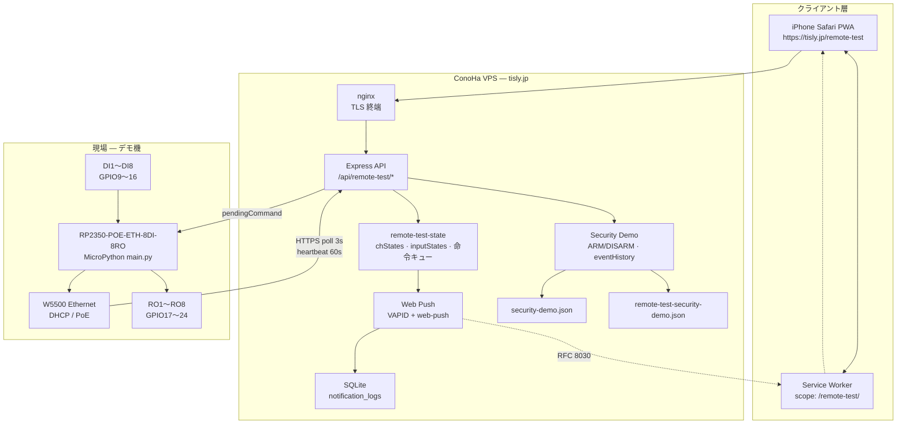
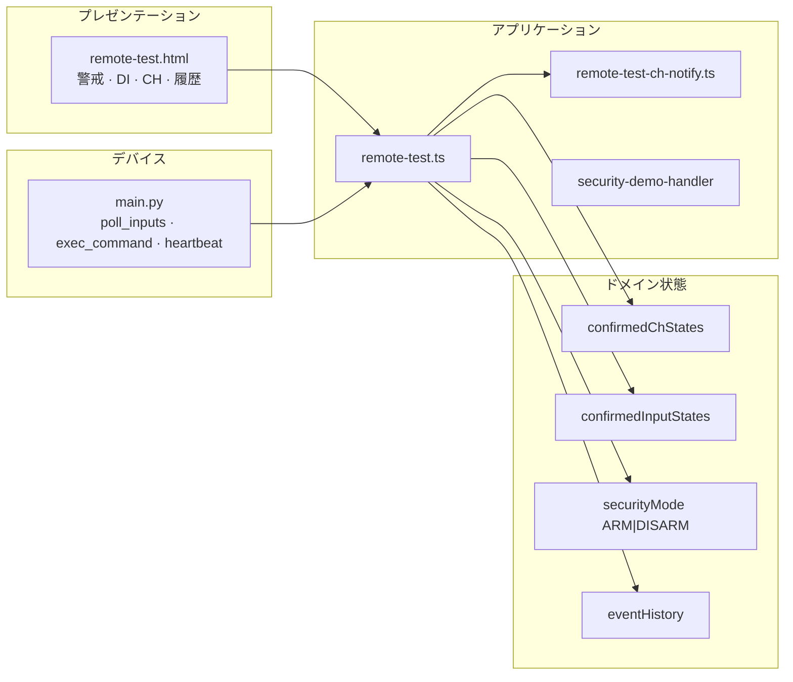
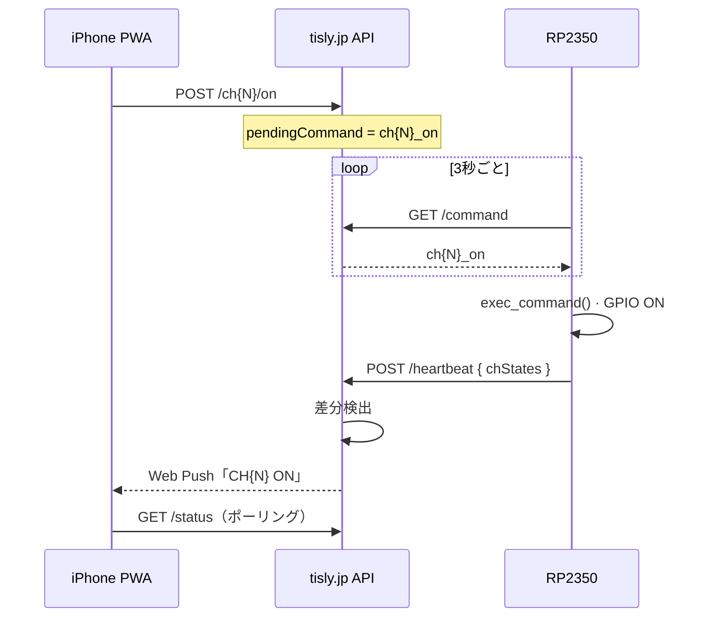
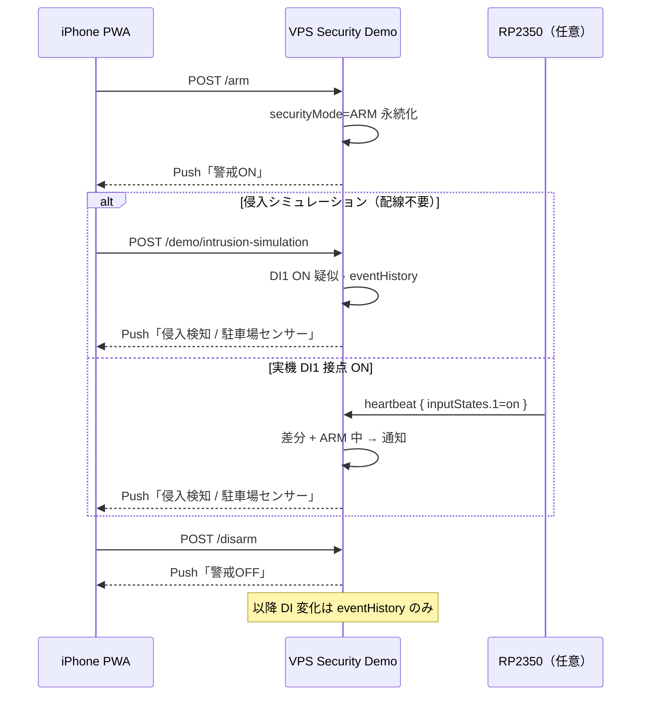
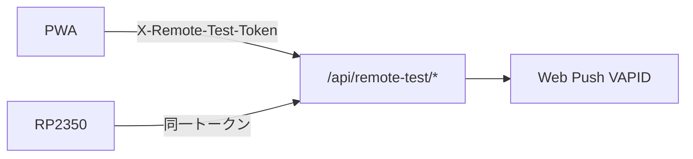

# TiSLY Lite RC1 — システム構成図

**対象:** TiSLY Lite RC1 Freeze（`1.4.0-remote-test-phase6`）  
**更新日:** 2026-06-08

---

## 1. 全体構成

---

## 2. 論理レイヤ

---

## 3. データフロー — CH 遠隔操作

---

## 4. データフロー — 警戒・侵入デモ

---

## 5. ネットワーク・ポート

| 経路 | プロトコル | ポート | 備考 |
|------|------------|--------|------|
| PWA ↔ VPS | HTTPS | 443 | nginx 経由 |
| RP2350 ↔ VPS | HTTPS | 443 | アウトバウンドのみ |
| RP2350 LAN | DHCP | — | W5500、PoE または DC 供給 |

**ファイアウォール:** RP2350 から `tisly.jp:443` への送信のみ必要（インバウンド不要）。

---

## 6. 認証・セキュリティ（RC1 スコープ）

| 項目 | RC1 実装 | Phase 7 予定 |
|------|----------|--------------|
| API 認証 | 共有トークン | per-device JWT / mTLS |
| 通信 | TLS 1.2+ | 維持 |
| マルチテナント | なし | テナント分離 |

---

## 7. タイミング定数

| 項目 | 値 | 定義元 |
|------|-----|--------|
| 命令ポーリング | 3 秒 | `config.POLL_INTERVAL_SEC` |
| heartbeat | 60 秒 | `config.HEARTBEAT_INTERVAL_SEC` |
| offline 判定 | 90 秒 | `DEVICE_OFFLINE_THRESHOLD_SEC` |
| PWA ポーリング | 5 秒 | `remote-test.js` |
| eventHistory 上限 | 100 件 | サーバー |
| notificationHistory 上限 | 50 件 | サーバー |

---

## 8. ファイルマップ

| 役割 | リポジトリパス |
|------|----------------|
| ファームウェア | `rp2350/firmware/main.py` |
| デバイス設定 | `rp2350/firmware/config.py` |
| API ルート | `server/src/api/routes/remote-test.ts` |
| 状態管理 | `server/src/remote-test/remote-test-state.ts` |
| Push 通知 | `server/src/remote-test/remote-test-ch-notify.ts` |
| セキュリティデモ | `server/src/remote-test/security-demo*.ts` |
| PWA | `server/public/remote-test.html` |
| センサー定義 | `server/config/security-demo.json` |

---

## 9. 関連図

- 8DI 詳細: [phase6-8di-configuration.md](../phase6-8di-configuration.md)
- Security Demo 画面: [security-demo-mode.md](../security-demo-mode.md)
- 配線: [wiring-diagram.md](./wiring-diagram.md)
