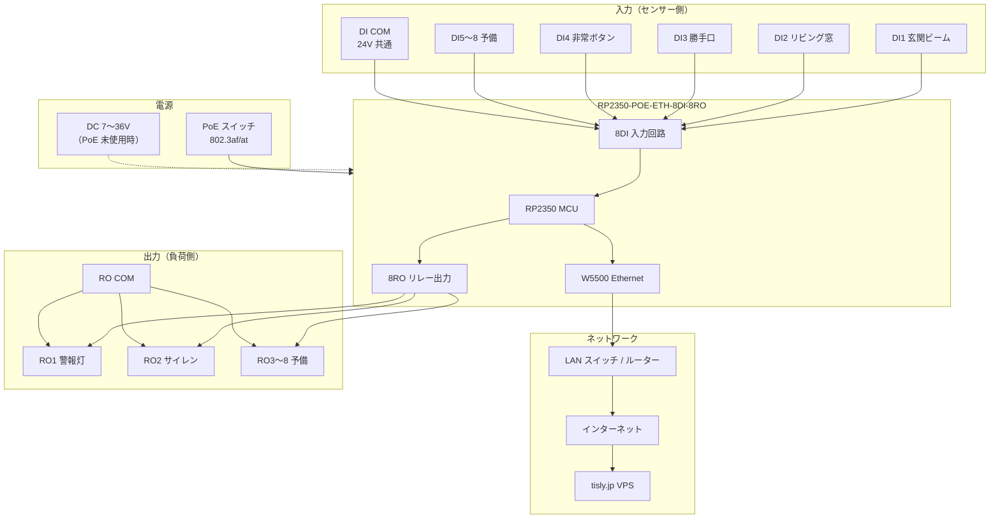
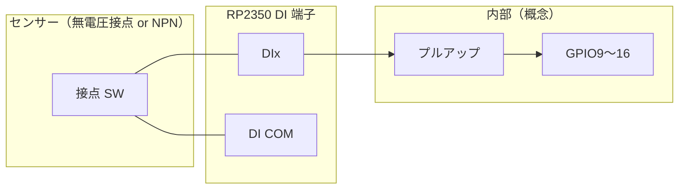
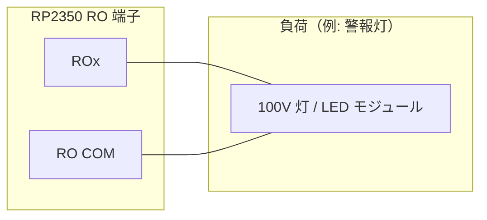
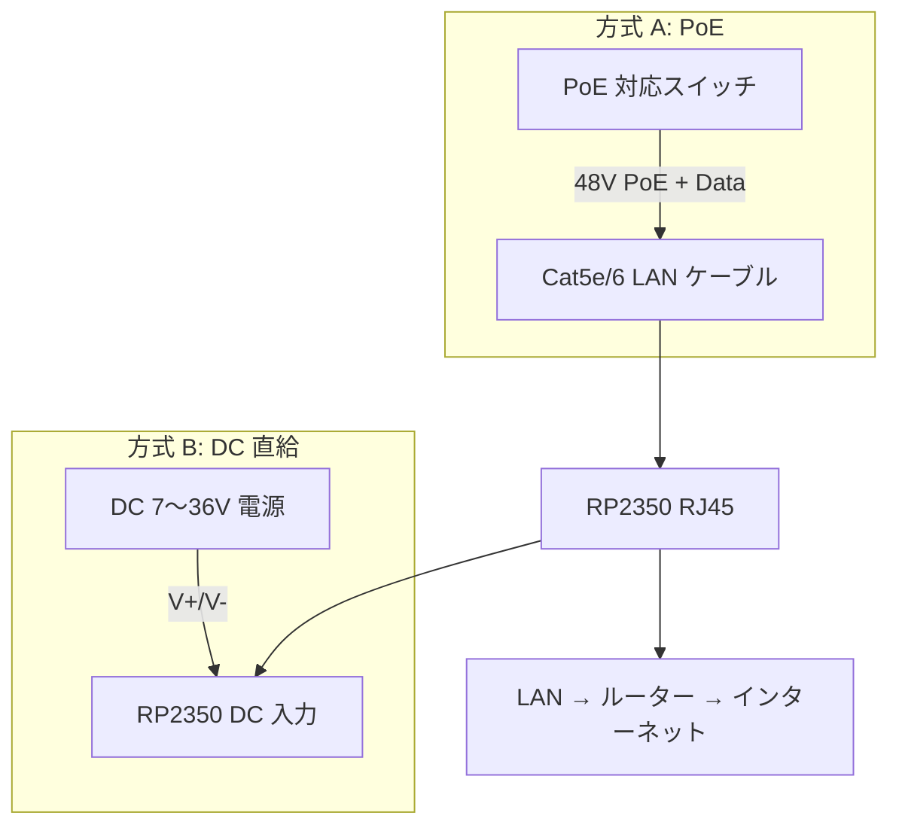

# TiSLY Lite RC1 — 配線図

**対象ボード:** Waveshare RP2350-POE-ETH-8DI-8RO  
**ファームウェア:** `1.4.0-remote-test-phase6`  
**更新日:** 2026-06-08

> 現場記入用テンプレート: [`rp2350/docs/wiring_field.md`](../../rp2350/docs/wiring_field.md)

---

## 1. システム配線概略



---

## 2. GPIO 端子マッピング

| 論理 | モジュール端子 | GPIO | 極性 / 論理 | デモ用途 |
|------|----------------|------|-------------|----------|
| DI1 | DI1 | GP9 | active-low | 玄関ビーム |
| DI2 | DI2 | GP10 | active-low | リビング窓 |
| DI3 | DI3 | GP11 | active-low | 勝手口 |
| DI4 | DI4 | GP12 | active-low | 非常ボタン |
| DI5 | DI5 | GP13 | active-low | 予備5 |
| DI6 | DI6 | GP14 | active-low | 予備6 |
| DI7 | DI7 | GP15 | active-low | 予備7 |
| DI8 | DI8 | GP16 | active-low | 予備8 |
| RO1 (CH1) | RO1 | GP17 | — | 警報灯 |
| RO2 (CH2) | RO2 | GP18 | — | サイレン |
| RO3 (CH3) | RO3 | GP19 | — | 予備 |
| RO4 (CH4) | RO4 | GP20 | — | 予備 |
| RO5 (CH5) | RO5 | GP21 | — | 予備 |
| RO6 (CH6) | RO6 | GP22 | — | 予備 |
| RO7 (CH7) | RO7 | GP23 | — | 予備 |
| RO8 (CH8) | RO8 | GP24 | — | 予備 |

**active-low:** 接点 ON（閉）= GPIO **LOW** → ファームウェアで `"on"` と解釈。

定義元: `rp2350/firmware/config.py`

---

## 3. DI（デジタル入力）配線



### 配線手順（無電圧接点）

1. センサー接点の一端を **DIx** に接続
2. もう一端を **DI COM** に接続
3. 接点 ON で DI が `"on"` になることを PWA で確認

### デモ用ジャンパ（卓上デモ）

| 目的 | 配線 |
|------|------|
| DI1 ON 疑似 | DI1 と DI COM をショート |
| DI1 OFF | ショート解除 |

---

## 4. RO（リレー出力）配線



### 注意事項

| 項目 | 推奨 |
|------|------|
| リレー接点容量 | モジュールシルク・データシートを確認 |
| 100V 配線 | 資格者作業・配線トレース・端子番号ラベル |
| デモ卓上 | 低電圧 LED モジュール推奨（100V は不要） |
| 飛び火 | RO OFF 時も負荷側の残留電圧に注意 |

---

## 5. 電源・Ethernet



| 項目 | 仕様 |
|------|------|
| PoE | 802.3af/at 対応スイッチ推奨 |
| DC 入力 | 7〜36V（Waveshare 仕様に従う） |
| Ethernet | 10/100Mbps、DHCP 既定 |
| 消費電流 | 待機時はデータシート参照（現場記入） |

---

## 6. デモキット最小構成（営業持ち出し）

```
[PoE スイッチ or DC+LAN]
        │
        ├── Cat5e ── RP2350 デモ機
        │
        └── (ルーター WAN) ── インターネット ── tisly.jp

[卓上]
  DI1 ── タクトスイッチ ── DI COM
  RO1 ── LED モジュール（5〜24V）

[iPhone]
  PWA https://tisly.jp/remote-test
```

---

## 7. センサー名称と DI の対応（営業説明用）

| DI | ラベル（security-demo.json） | イベント種別 |
|----|------------------------------|--------------|
| DI1 | 玄関ビーム | intrusion |
| DI2 | リビング窓 | window |
| DI3 | 勝手口 | intrusion |
| DI4 | 非常ボタン | emergency |
| DI5〜8 | 予備5〜8 | spare |

名称変更: `server/config/security-demo.json` を編集（コード変更不要・VPS 再起動で反映）。

---

## 8. 検査チェックリスト

| # | 項目 | 合格基準 | ☐ |
|---|------|----------|---|
| 1 | 電源投入 | PWR LED 点灯 | |
| 2 | Link LED | Ethernet Link 点灯 | |
| 3 | DHCP | ルーターに IP 割当 | |
| 4 | heartbeat | PWA online、60 秒更新 | |
| 5 | DI1 ジャンパ | ON/OFF で PWA カード変化 | |
| 6 | CH1 PWA 操作 | 3 秒以内 RO1 動作 | |
| 7 | 極性 | 接点 ON = PWA 緑（on） | |

自動検証: `rp2350/test/device_verify_di_test.py`

---

## 9. 参考リンク

- [Waveshare RP2350-ETH-8DI-8RO Wiki](https://www.waveshare.com/wiki/RP2350-ETH-8DI-8RO)
- [phase6-8di-configuration.md](../phase6-8di-configuration.md)
- [rp2350_first_setup.md](../../rp2350/docs/rp2350_first_setup.md)（存在する場合）
