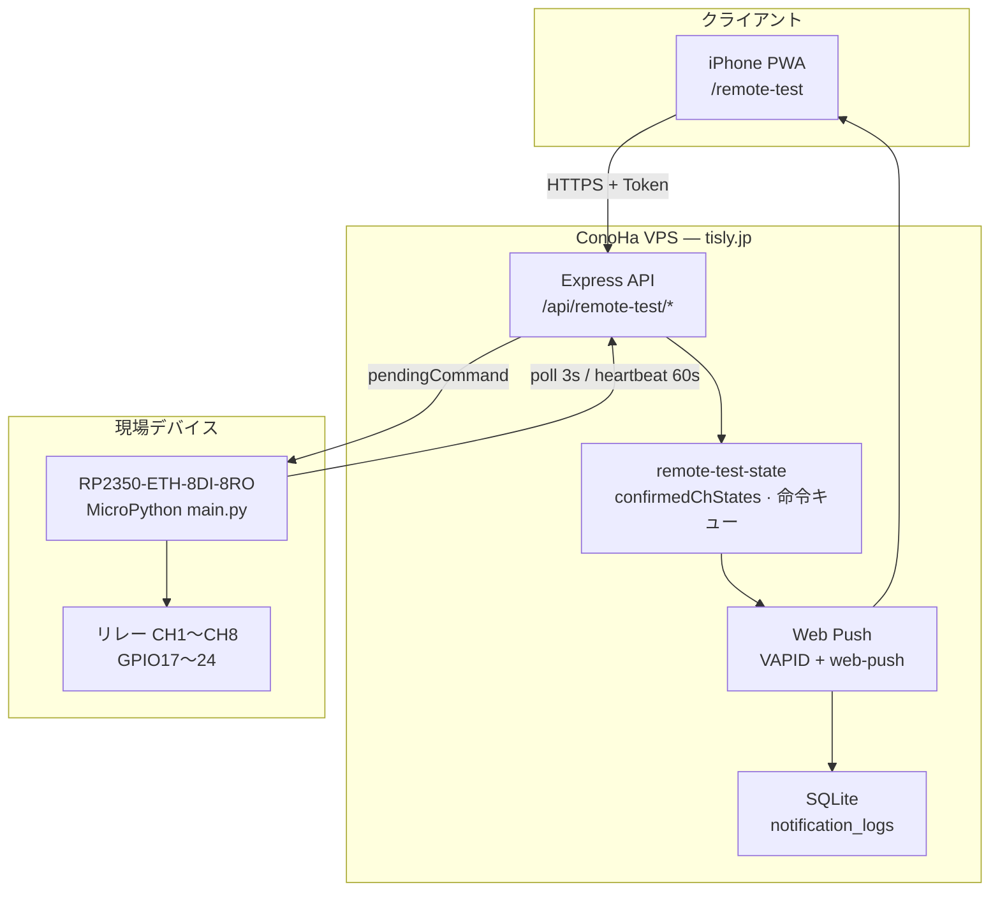

# Remote Test RC1 — 完了レポート

**日付:** 2026-06-08  
**リリース:** `1.3.0-remote-test-rc1`  
**ステータス:** Remote Test RC1 完了

---

## 1. 構成図

| コンポーネント | 技術 | 備考 |
|----------------|------|------|
| PWA | Service Worker + Web Push | `scope: /remote-test/` |
| VPS | Node.js 20 · Express | ConoHa VPS `/opt/tisly` |
| RP2350 | MicroPython · W5500 Ethernet | DHCP · PoE/LAN |
| 永続化 | SQLite（通知ログ） | インメモリ状態は再起動でリセット |

---

## 2. 通信フロー

### 2.1 遠隔操作（PWA → 実機）

1. PWA が `POST /api/remote-test/ch{N}/on|off` を送信。
2. VPS が `pendingCommand` に `ch{N}_on|off` を格納。
3. RP2350 が `GET /api/remote-test/command`（3 秒間隔）で取得。
4. `exec_command()` が GPIO を切り替え、`ch_states` を更新。
5. 命令実行直後に `send_heartbeat()` で状態を VPS へ送信。

### 2.2 状態同期・通知（実機 → PWA）

1. RP2350 が定期（60 秒）または命令直後に `POST /api/remote-test/heartbeat`。
2. VPS が `chStates` を `confirmedChStates` に反映。
3. 前回 heartbeat との差分を検出。
4. 変化があれば Web Push で「TiSLY CH{N} ON/OFF」を送信。
5. PWA が `/status` ポーリングで画面を更新。

詳細シーケンス: [`remote-test-notification-flow.md`](remote-test-notification-flow.md)

### 2.3 タイミング定数

| 項目 | 値 |
|------|-----|
| 命令ポーリング | 3 秒 |
| heartbeat 間隔 | 60 秒 |
| offline 判定 | 90 秒（`DEVICE_OFFLINE_THRESHOLD_SEC`） |
| CH 応答目標 | 3 秒以内（poll 周期に依存） |

---

## 3. 認証方式

### 3.1 Remote Test 共有トークン

| 項目 | 内容 |
|------|------|
| 設定 | VPS `REMOTE_TEST_TOKEN`（`.env`）= RP2350 `config.REMOTE_TEST_TOKEN` |
| 送信方法 | ヘッダ `X-Remote-Test-Token`、または `Authorization: Bearer`、または `?token=` |
| 適用範囲 | `/api/remote-test/*` 全エンドポイント |
| PWA | localStorage にトークン保存後、全 API リクエストに付与 |

### 3.2 Web Push（VAPID）

| 項目 | 内容 |
|------|------|
| 鍵 | `VAPID_PUBLIC_KEY` / `VAPID_PRIVATE_KEY` / `VAPID_SUBJECT` |
| ユーザー | 固定 `remote-test`（専用 DB ユーザー） |
| 登録 | PWA 初回アクセス時に `POST /api/push/subscribe` |

**RC1 の位置づけ:** デモ・実機検証用の共有シークレット。本番マルチテナント認証は Phase 6 以降で設計。

---

## 4. Push 通知方式

| 項目 | 実装 |
|------|------|
| プロトコル | Web Push（RFC 8030） |
| ライブラリ | `web-push`（Node.js） |
| トリガー | heartbeat `chStates` 差分検出 |
| ペイロード例 | `title: "TiSLY CH4 ON"`, `body: "CH4 ON"`, `url: "/remote-test"` |
| 手動テスト | `POST /api/remote-test/notify`（固定メッセージ） |
| 履歴 | インメモリ `notificationHistory` + DB `notification_logs` |

通知は **実機が heartbeat で報告した状態変化** にのみ依存する。PWA 側の楽観 UI 更新では通知しない。

---

## 5. 既知の制限

| # | 制限 | 影響 |
|---|------|------|
| 1 | HTTP ポーリング（MQTT 未使用） | 命令応答は最大約 3 秒、常時接続ではない |
| 2 | 共有トークン認証 | トークン漏洩時は全 CH 操作可能 |
| 3 | 単一 RP2350 想定 | `DEVICE_ID` 固定、マルチデバイス未対応 |
| 4 | VPS 状態はインメモリ | サーバー再起動で `confirmedChStates`・命令キューがリセット |
| 5 | 初回 heartbeat は通知しない | ベースライン確立のため起動直後の変化は 2 回目以降から通知 |
| 6 | CH 同時操作 | 命令は 1 件キュー。連打時は順次処理 |
| 7 | offline 90 秒 | heartbeat 60 秒 + 余裕。急な切断検知に遅延あり |
| 8 | Web Push 端末依存 | iOS は PWA ホーム画面追加が必要。未登録時は Push 失敗 |

---

## 6. 検証済み項目（RC1）

- [x] PWA から CH1〜CH8 ON/OFF（3 秒以内応答）
- [x] RP2350 heartbeat 60 秒周期 + 命令直後即時 heartbeat
- [x] `chStates` 差分による Web Push 通知
- [x] RESET 後 60 秒以内に PWA 全 CH OFF 同期
- [x] offline 判定（90 秒）
- [x] `GET /api/remote-test/debug` デバッグスナップショット

---

## 7. 次 Phase 候補

| Phase | 内容 | 優先度 |
|-------|------|--------|
| **Phase 6** | MQTT 本格移行（ポーリング廃止・双方向） | 高 |
| **Phase 6** | デバイス個別認証（JWT / クライアント証明書） | 高 |
| **Phase 7** | マルチデバイス・テナント分離 | 中 |
| **Phase 7** | QNAP イベント連携・アーカイブ | 中 |
| **Phase 8** | Node-RED フロー統合（`tisly_home_v1.json`） | 中 |
| **Phase 8** | DI（デジタル入力）8ch 読み取り・イベント通知 | 中 |
| **Phase 9** | 本番 Pro Remote（双方向 WebSocket） | 低（別ライン） |
| **Phase 10** | 製造・OTA・リリースパイプライン | 低 |

**RC1 からの推奨着手順:**

1. **MQTT TLS** — `rp2350/docs/mqtt_topics.md` に沿ったトピック設計の実装
2. **認証強化** — 共有トークンから per-device credential へ
3. **永続状態** — Redis / DB で `confirmedChStates` と命令キューをサーバー再起動後も保持

---

## 8. 参照ドキュメント

| ドキュメント | 内容 |
|--------------|------|
| [`remote-test-notification-flow.md`](remote-test-notification-flow.md) | 通知フロー詳細図 |
| [`remote-test-phase2-deploy.md`](remote-test-phase2-deploy.md) | VPS デプロイ手順 |
| [`rp2350-phase2-poc-verification.md`](rp2350-phase2-poc-verification.md) | Phase 2 PoC 記録 |
| [`rp2350_phase3_design.md`](rp2350_phase3_design.md) | Phase 3 CH 拡張設計 |
