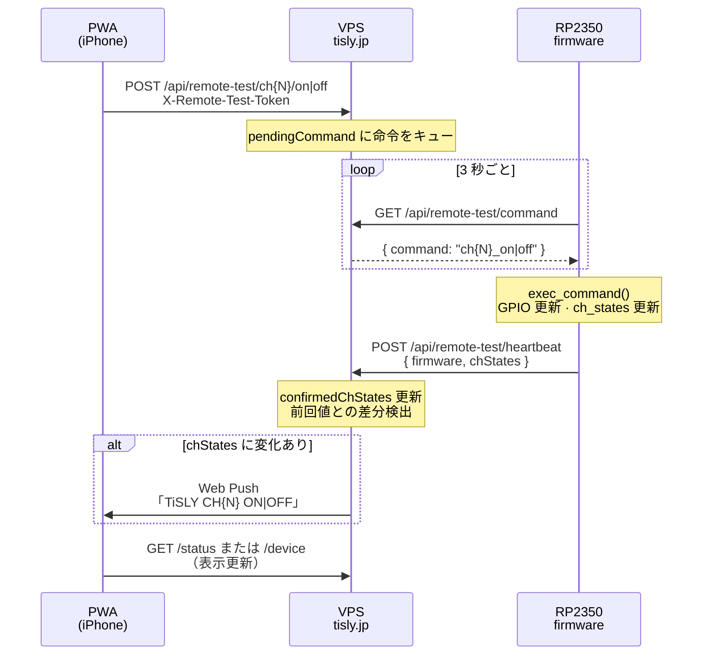

# Remote Test — 通知フロー（RC1）

**ファームウェア版:** `1.3.0-remote-test-rc1`  
**対象:** iPhone PWA → VPS → RP2350 → Web Push 通知

---

## 概要

PWA から CH を操作すると、VPS が命令キューに積み、RP2350 がポーリングで取得・GPIO 実行します。  
実行後 RP2350 が **heartbeat** で `chStates` を VPS に送り、VPS が前回値との **差分** を検出して Web Push 通知を送ります。

**状態の正:** RP2350 実機側の `ch_states`（heartbeat で確定した `confirmedChStates`）。

---

## フロー図



---

## ステップ詳細

| # | コンポーネント | 処理 | API / 関数 |
|---|----------------|------|------------|
| 1 | **PWA** | ユーザーが CH ON/OFF ボタンをタップ | `POST /api/remote-test/ch{N}/on\|off` |
| 2 | **VPS command** | トークン検証後、`pendingCommand` に `ch{N}_on\|off` を格納 | `queueChCommand()` |
| 3 | **RP2350 poll** | 3 秒間隔で命令を取得 | `GET /api/remote-test/command` → `poll_command()` |
| 4 | **exec_command** | GPIO 出力・ローカル `ch_states` 更新 | `exec_command()` in `main.py` |
| 5 | **ch_states update** | 該当 CH の `"on"` / `"off"` をメモリ上で更新 | `ch_states[str(channel)] = ...` |
| 6 | **send_heartbeat** | 全 CH 状態を VPS へ POST（命令実行直後も即時送信） | `POST /api/remote-test/heartbeat` |
| 7 | **VPS detect diff** | `lastDeviceChStates` と比較し変化 CH を抽出 | `recordDeviceHeartbeat()` → `detectChStateChanges()` |
| 8 | **Push notification** | 変化ごとに Web Push 送信・履歴記録 | `notifyChStateChanges()` → `sendWebPush()` |

---

## heartbeat ペイロード例

```json
{
  "firmware": "1.3.0-remote-test-rc1",
  "chStates": {
    "1": "off", "2": "off", "3": "off", "4": "on",
    "5": "off", "6": "off", "7": "off", "8": "off"
  }
}
```

---

## 差分検出のルール

1. **初回 heartbeat** — ベースライン確立のみ。通知は送らない（`deviceChStatesBaselined`）。
2. **2 回目以降** — `confirmedChStates` と前回 `lastDeviceChStates` を比較。
3. **同一状態の連続 heartbeat** — 差分なしのため通知しない。
4. **PWA 楽観更新** — 通知トリガーにならない。heartbeat で確定した状態のみが正。

---

## デバッグ API

運用・実機確認用:

```bash
curl -s -H "X-Remote-Test-Token: $TOKEN" \
  https://tisly.jp/api/remote-test/debug | jq .
```

| フィールド | 意味 |
|------------|------|
| `heartbeatBody` | 直近 heartbeat のリクエスト body |
| `confirmedChStates` | RP2350 確定済み CH 状態（通知の正） |
| `notificationHistory` | 直近の Push 通知履歴（最大 50 件） |
| `lastPushResult` | 最後の Push 送信結果 `{ success, error? }` |

---

## 関連ファイル

| 層 | パス |
|----|------|
| PWA | `server/public/js/remote-test.js` |
| VPS API | `server/src/api/routes/remote-test.ts` |
| 状態・差分 | `server/src/remote-test/remote-test-state.ts` |
| Push 送信 | `server/src/remote-test/remote-test-ch-notify.ts` |
| RP2350 | `rp2350/firmware/main.py` · `config.py` |
