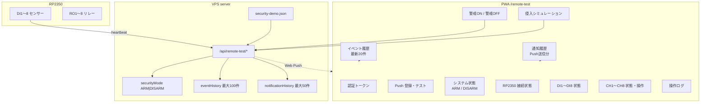
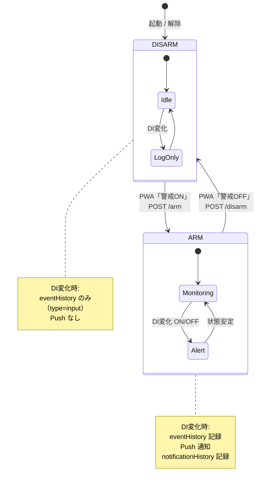

# TiSLY Lite Security Demo Mode

**目的:** Remote Test PoC を営業デモ可能な「TiSLY Lite 防犯デモ機」として動作させる。

**対象 URL:** https://tisly.jp/remote-test  
**設定ファイル:** `server/config/security-demo.json`  
**状態永続化:** `server/data/remote-test-security-demo.json`（警戒モード・イベント履歴）

---

## 画面構成図



---

## 状態遷移図



---

## API 一覧（追加分）

| メソッド | パス | 説明 |
|----------|------|------|
| POST | `/api/remote-test/arm` | 警戒 ON（永続化・Push・履歴） |
| POST | `/api/remote-test/disarm` | 警戒 OFF（永続化・Push・履歴） |
| POST | `/api/remote-test/demo/intrusion-simulation` | DI1 ON を疑似発生（配線不要デモ） |
| GET | `/api/remote-test/status` | `securityMode` · `eventHistory` · `eventHistoryDisplay` を追加 |

---

## センサー設定（security-demo.json）

| DI | 用途 | イベント種別 | Push タイトル（ON） |
|----|------|-------------|---------------------|
| DI1 | 駐車場センサー | intrusion | 侵入検知 |
| DI2 | リビング窓 | window | 窓開放検知 |
| DI3 | 勝手口 | intrusion | 侵入検知 |
| DI4 | 非常ボタン | emergency | 非常ボタン押下 |
| DI5〜8 | 予備 | spare | センサー反応 |

名称・通知文は `server/config/security-demo.json` を編集して変更可能。

---

## 営業デモ手順（推奨）

1. iPhone で PWA をホーム画面に追加し Push 登録
2. **警戒ON** をタップ → Push「警戒ON」
3. **侵入シミュレーション** をタップ → Push「侵入検知 / 駐車場センサー」
4. 実機がある場合は DI1 接点を ON にして同様の通知を確認
5. **警戒OFF** をタップ → 以降のセンサー変化はイベント履歴のみ

---

## テスト

```bash
cd server && npx tsx --test test/remote-test.test.ts
```

| シナリオ | 期待結果 |
|----------|----------|
| ARM + DI1 ON | eventHistory + Push + notificationHistory |
| DISARM + DI1 ON | eventHistory のみ（Push なし） |
| POST /arm | securityMode=ARM がファイルに永続化 |
