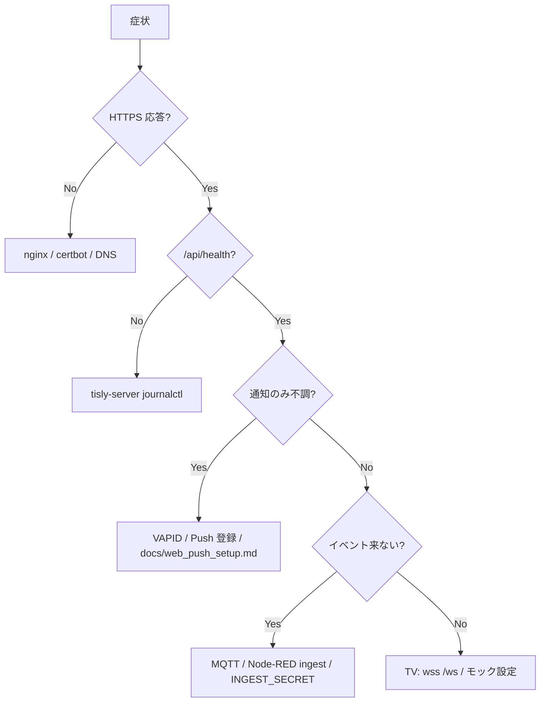

# TiSLY VPS 本番デプロイ手順（Phase 41–60）

ConoHa VPS + **tisly.jp** で通知基盤を本番運用するための手順書です。  
秘密情報は `.env` にのみ置き、リポジトリにはコミットしません。

## 前提

| 項目 | 推奨 |
|------|------|
| VPS | ConoHa VPS（Ubuntu 22.04 LTS 想定） |
| ドメイン | `tisly.jp`（A レコード → VPS IP） |
| アプリ配置 | `/opt/tisly` |
| 実行ユーザー | `tisly`（専用） |
| Node.js | 20 LTS |
| DB | SQLite（`server/data/`）— PostgreSQL 移行は将来 TODO |

## URL 設計

| URL | 用途 |
|-----|------|
| `https://tisly.jp/` | PWA（管理ダッシュボード） |
| `https://tisly.jp/api/*` | REST API |
| `https://tisly.jp/notifications` | 通知センター |
| `https://tisly.jp/settings` | Platform Settings |
| `https://tisly.jp/tv` | TV 表示確認用プレビュー |
| `wss://tisly.jp/ws` | WebSocket（TV / 将来クライアント） |
| MQTT | **VPS 内部のみ**（`127.0.0.1:1883`）— 外部公開しない |

## 1. 初期セットアップ

```bash
sudo apt update && sudo apt upgrade -y
sudo adduser --disabled-password --gecos "" tisly
sudo mkdir -p /opt/tisly
sudo chown tisly:tisly /opt/tisly
```

リポジトリを `/opt/tisly` に配置（`git clone` または rsync）。  
`server/.env` を `server/.env.example` から作成し、本番値を設定。

## 2. Node.js 導入

```bash
curl -fsSL https://deb.nodesource.com/setup_20.x | sudo -E bash -
sudo apt install -y nodejs build-essential
node -v   # v20.x
```

```bash
cd /opt/tisly/server
sudo -u tisly npm ci
sudo -u tisly npm run build
sudo -u tisly npm run db:init
```

## 3. Mosquitto（内部 MQTT）

```bash
sudo apt install -y mosquitto mosquitto-clients
```

`/etc/mosquitto/conf.d/tisly.conf`（例）:

```conf
listener 1883 127.0.0.1
allow_anonymous false
password_file /etc/mosquitto/passwd
```

```bash
sudo mosquitto_passwd -c /etc/mosquitto/passwd tisly_mqtt
# .env の MQTT_USERNAME / MQTT_PASSWORD と一致させる
sudo systemctl enable mosquitto
sudo systemctl restart mosquitto
```

**外部から 1883 を開かない**（`docs/security_baseline.md` 参照）。

## 4. Node-RED

```bash
sudo npm install -g --unsafe-perm node-red
```

フローは `~tisly/.node-red` または `/opt/tisly/node-red`。  
MQTT 受信 → HTTP ingest で server へ渡す設計は `docs/node_red_http_ingest.md` を参照。

```bash
sudo cp /opt/tisly/server/deploy/systemd/tisly-node-red.service /etc/systemd/system/
sudo systemctl daemon-reload
sudo systemctl enable tisly-node-red
sudo systemctl start tisly-node-red
```

## 5. TiSLY server 起動

```bash
cd /opt/tisly/server
cp .env.example .env
# 編集: VAPID, SMTP, INGEST_SECRET 等
npm run build
npm run db:init
```

## 6. systemd 化

テンプレート: `server/deploy/systemd/`（README 付き）

```bash
sudo cp /opt/tisly/server/deploy/systemd/*.service /etc/systemd/system/
sudo systemctl daemon-reload
sudo systemctl enable tisly-server
sudo systemctl start tisly-server
sudo systemctl status tisly-server
```

## 7. nginx リバースプロキシ

```bash
sudo apt install -y nginx
sudo cp /opt/tisly/server/deploy/nginx/tisly.jp.conf /etc/nginx/sites-available/tisly.jp
sudo ln -s /etc/nginx/sites-available/tisly.jp /etc/nginx/sites-enabled/
sudo nginx -t && sudo systemctl reload nginx
```

## 8. Let's Encrypt HTTPS

```bash
sudo apt install -y certbot python3-certbot-nginx
sudo certbot --nginx -d tisly.jp -d www.tisly.jp
```

証明書自動更新: `certbot renew` の timer が有効か確認。

## 9. ファイアウォール

```bash
sudo ufw default deny incoming
sudo ufw default allow outgoing
sudo ufw allow OpenSSH
sudo ufw allow 'Nginx Full'
sudo ufw enable
sudo ufw status
```

開放するのは **22（SSH）** と **80/443（HTTP/HTTPS）** のみ。MQTT ポートは開放しない。

## 10. ログ確認

| 対象 | コマンド |
|------|----------|
| TiSLY server | `journalctl -u tisly-server -f` |
| Node-RED | `journalctl -u tisly-node-red -f` |
| nginx | `sudo tail -f /var/log/nginx/access.log error.log` |
| Mosquitto | `sudo journalctl -u mosquitto -f` |

## 11. 再起動後の自動復旧

- `systemctl enable` で `tisly-server`, `tisly-node-red`, `mosquitto`, `nginx` を有効化
- VPS 再起動後: `curl -s https://tisly.jp/health` が `{"status":"ok"}` を返すこと

## 12. トラブル時の切り分け



| 症状 | 確認 |
|------|------|
| 502 Bad Gateway | `tisly-server` 稼働、`TISLY_PORT` と nginx upstream 一致 |
| Push 来ない | VAPID、HTTPS、iOS はホーム画面追加後に許可 |
| イベント無し | Mosquitto ローカル、`MQTT_URL`、Node-RED HTTP POST |
| TV 未接続 | `EXPO_PUBLIC_MQTT_WS`、mock モード、ファイアウォールで ws ブロック無し |

## 関連ドキュメント

- `docs/web_push_setup.md` — VAPID / PWA Push
- `docs/node_red_http_ingest.md` — Node-RED → server
- `docs/unified_event_format.md` — イベント JSON
- `docs/security_baseline.md` — セキュリティ基準
- `server/deploy/systemd/README.md`
- `server/deploy/nginx/tisly.jp.conf`
