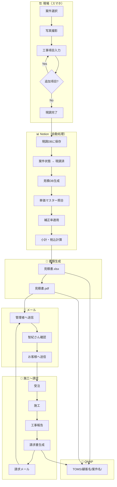
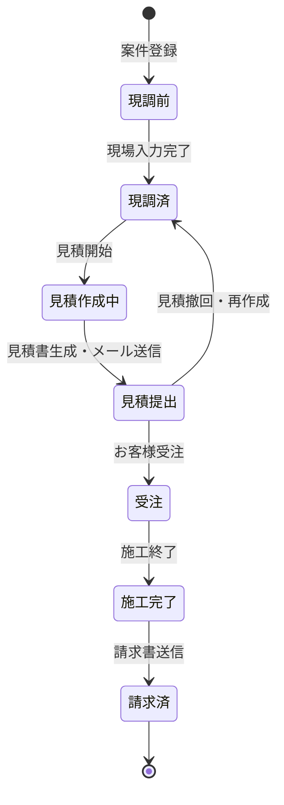

# TOMS 業務フロー・運用マニュアル

> **TOMS** — 現調 → 見積 → 請求 自動化システム（Notion基盤）  
> 最終更新: 2026-05-31

---

## 1. 全体フロー

### 1.1 業務フロー概要

```
現調（現場）
    ↓
Notion入力（スマホ）
    ↓
見積自動生成
    ↓
PDF / Excel 生成
    ↓
QNAP 保存
    ↓
管理者メール送信（智紀さん）
    ↓
内容確認
    ↓
お客様へ送信（手動）
```

### 1.2 詳細フロー図



---

## 2. フェーズ別オペレーション

### フェーズ1: 案件登録

**担当**: 管理者（PC）  
**所要時間**: 約2分

#### 手順

1. Notion → **案件管理DB** を開く
2. 「新規」をクリック
3. 以下を入力:

| 項目 | 入力内容 |
|------|---------|
| 案件名 | 現場名称（例: 土浦寮） |
| 顧客名 | 顧客マスターから選択 |
| 担当者 | TOMS担当者 |
| 住所 | 現場住所 |
| 電話番号 | 連絡先 |
| 現調日 | 現調予定日 |
| 状態 | `現調前`（自動） |

4. 保存 → **案件番号**（TOMS-XXXX）が自動採番される

#### チェックポイント

- [ ] 顧客名は顧客マスターに登録済みか
- [ ] 顧客区分・補正率が正しく表示されているか（Rollup確認）
- [ ] 現調日が正しいか

---

### フェーズ2: 現場現調入力

**担当**: 現場担当者（スマホ）  
**所要時間**: **3分以内**（1案件あたり）

#### 事前準備

- スマホのホーム画面に Notion「TOMS 現場入力」フォームをブックマーク
- 案件が事前登録されていること

#### 手順

```
Step 1: 案件選択
  └ Notionアプリ → TOMS 現場入力フォーム → 案件を選択

Step 2: 写真撮影（先行）
  └ 📷 ボタン → 現場写真を撮影（複数可）
  └ 先に写真を撮っておくと後から項目入力がスムーズ

Step 3: 工事項目入力
  └ 場所 → タップ選択（1階トイレ、廊下 等）
  └ 工事分類 → タップ選択（換気、照明 等）
  └ 作業内容 → タップ選択（交換、新設 等）
  └ 型式・サイズ → 入力 or 音声入力（φ100 等）
  └ 数量 → +/- ボタン
  └ オプション → 既設撤去 / 高所作業 / 足場必要
  └ 見積反映 → ON（デフォルト）

Step 4: 保存
  └ 「保存」ボタン

Step 5: 追加項目
  └ 同じ現場に複数項目がある場合:
     ・「同項目複製」→ 数量や型式のみ変更
     ・「新規項目」→ Step 2 から繰り返し

Step 6: 現調完了
  └ 全項目入力後 → 案件管理DBの状態を「現調済」に更新
```

#### 入力のコツ

| シーン | 推奨操作 |
|--------|---------|
| 同じ場所に換気複数 | 1件目保存 → 複製 → 型式変更 |
| 同じ型式を複数箇所 | 1件目保存 → 複製 → 場所変更 |
| 見積に入れない参考情報 | 見積反映を OFF にして保存 |
| 型式が不明 | 備考に記入、型式は「未定」 |

#### チェックポイント

- [ ] 全工事箇所の項目を入力したか
- [ ] 写真は各箇所につき最低1枚あるか
- [ ] 見積反映 OFF の項目が意図的か確認
- [ ] 案件状態を「現調済」に更新したか

---

### フェーズ3: 見積作成

**担当**: 管理者（PC）  
**所要時間**: 約5分（自動生成後は確認のみ）

#### 手順

1. 案件管理DB → 対象案件（状態: 現調済）を開く
2. 状態を `見積作成中` に変更
3. **見積DB** に新規レコード作成:
   - 案件: 対象案件を選択
   - 工事項目: 現調DBの「見積反映=ON」項目を関連付け
4. 自動計算を確認:

| 項目 | 確認内容 |
|------|---------|
| 補正率 | 顧客区分に応じた値か |
| 小計 | 各項目の見積金額合計 |
| 消費税 | 小計 × 10% |
| 税込合計 | 小計 + 消費税 |

5. 見積書を生成（自動化連携後はボタン1つ）:
   - 見積書.xlsx
   - 見積書.pdf
6. 見積DBに PDF / xlsx を添付
7. PDF出力フラグを ON
8. 案件状態を `見積提出` に変更

#### 見積金額の手動調整

自動計算結果を修正する場合:

1. 現調DBの該当項目 → 備考に調整理由を記載
2. 見積DBの備考に調整後金額と理由を記録
3. 小計を手動で上書き（Formula項目は別途対応）

> **原則**: 自動計算を基本とし、手動調整は例外として記録を残す。

#### チェックポイント

- [ ] 全「見積反映=ON」項目が見積に含まれているか
- [ ] 単価マスターに未登録の型式がないか
- [ ] 補正率は正しいか
- [ ] PDF の内容は正しいか

---

### フェーズ4: QNAP 保存

**担当**: 自動（将来）/ 管理者（初期）  
**保存先**: `QNAP/TOMS/{顧客名}/{案件名}/`

#### 手動保存手順（初期運用）

1. QNAP にログイン
2. `TOMS/{顧客名}/{案件名}/` フォルダを作成
3. 以下をアップロード:

| ファイル | ソース |
|---------|--------|
| 現調写真/ | 現調DB → 写真をダウンロード |
| 見積書.xlsx | 見積DB → 見積書xlsx |
| 見積書.pdf | 見積DB → 見積書PDF |

#### チェックポイント

- [ ] フォルダ構成が命名規則に沿っているか
- [ ] 写真ファイル名に日付・場所が含まれているか

---

### フェーズ5: 管理者メール通知

**担当**: 自動送信  
**宛先**: 智紀さんの仕事用メール  
**重要**: Gmail下書きは使用しない。直接送信する。

#### 見積書メール

| 項目 | 内容 |
|------|------|
| 宛先 | 管理者メールアドレス |
| 件名 | `【見積作成完了】{顧客名}_{案件名}` |
| 本文 | 下記テンプレート |
| 添付 | 見積書.xlsx, 見積書.pdf |

**本文テンプレート:**

```
見積書を作成しました。

案件名：{案件名}
顧客：{顧客名}
税込金額：{税込合計}円

添付PDFをご確認ください。

---
TOMS 自動通知
案件番号: {案件番号}
見積番号: {見積番号}
```

#### 請求書メール

| 項目 | 内容 |
|------|------|
| 件名 | `【請求書作成完了】{顧客名}_{案件名}` |
| 添付 | 請求書.xlsx, 請求書.pdf |

**本文テンプレート:**

```
請求書を作成しました。

案件名：{案件名}
顧客：{顧客名}
税込金額：{税込金額}円
支払期限：{支払期限}

添付PDFをご確認ください。

---
TOMS 自動通知
案件番号: {案件番号}
請求番号: {請求番号}
```

---

### フェーズ6: 管理者確認 → お客様送信

**担当**: 智紀さん  
**重要**: お客様への自動送信は禁止。必ず確認後に手動送信。

#### 手順

```
1. メール受信 → 添付PDFを確認
2. Notion → 見積DB → 該当レコードを開く
3. 内容確認:
   ├ 工事項目・数量・金額
   ├ 顧客名・案件名
   └ 税込合計
4. 問題なし → 管理者確認チェックを ON
5. お客様へメール送信（手動）
6. お客様送信日を記録
7. 案件状態を更新:
   ├ 見積 → 「受注」（受注時）
   └ 見積のみ → 状態維持
```

#### お客様メール（手動送信）

| 項目 | 内容 |
|------|------|
| 宛先 | お客様メールアドレス |
| 件名 | `【お見積書】{案件名}（{会社名}）` |
| 添付 | 見積書.pdf |
| CC | 必要に応じて |

> **注意**: お客様にはPDFのみ添付。xlsxは社内用。

#### チェックポイント

- [ ] PDF内容に誤りがないか
- [ ] 顧客名・敬称は正しいか
- [ ] 管理者確認チェックを ON にしたか
- [ ] お客様送信日を記録したか

---

### フェーズ7: 施工 → 工事報告

**担当**: 現場担当者 + 管理者

#### 手順

1. 受注後 → 案件状態を `受注` に変更
2. 工事予定日を設定
3. 施工実施
4. 施工完了 → 案件状態を `施工完了` に変更
5. **工事報告DB** にレコード作成:
   - 施工完了日
   - 作業内容概要
   - 完了写真（複数）
6. 工事報告書PDF生成（将来自動化）
7. QNAP に保存

---

### フェーズ8: 請求

**担当**: 管理者（PC）

#### 手順

1. 案件状態: `施工完了` を確認
2. **請求DB** に新規レコード作成:
   - 案件: 対象案件
   - 見積: 元見積（あれば）
   - 請求日: 本日
   - 請求金額: 見積小計 or 調整後金額
3. 請求書を生成:
   - 請求書.xlsx
   - 請求書.pdf
4. QNAP に保存
5. 管理者メール送信（フェーズ5と同様）
6. 智紀さん確認 → お客様へ手動送信
7. 案件状態を `請求済` に変更

#### 入金確認

1. 入金確認 → 請求DBの「入金確認」を ON
2. 入金日を記録

---

## 3. 状態遷移マトリクス



| 現在状態 | 次状態 | トリガー | 担当 |
|---------|--------|---------|------|
| 現調前 | 現調済 | 現調入力完了 | 現場担当 |
| 現調済 | 見積作成中 | 見積作成開始 | 管理者 |
| 見積作成中 | 見積提出 | PDF生成・メール送信 | 自動/管理者 |
| 見積提出 | 受注 | お客様受注確認 | 智紀さん |
| 見積提出 | 現調済 | 見積再作成 | 管理者 |
| 受注 | 施工完了 | 施工完了報告 | 現場担当 |
| 施工完了 | 請求済 | 請求書送信完了 | 管理者 |

---

## 4. 日常運用チェックリスト

### 4.1 毎日（管理者）

- [ ] ダッシュボードで今日の現調予定を確認
- [ ] 新規現調入力の完了を確認（状態: 現調済）
- [ ] 見積作成待ち案件を処理
- [ ] 管理者メールの確認・お客様送信

### 4.2 現調当日（現場担当）

- [ ] Notion「現場入力」フォームを開く
- [ ] 写真撮影 → 項目入力 → 保存
- [ ] 全項目入力後「現調済」に更新

### 4.3 月末（管理者）

- [ ] 未請求一覧ビューで請求漏れを確認
- [ ] 月末請求対象案件の請求書作成
- [ ] 入金確認の更新
- [ ] 売上集計（将来自動化）

---

## 5. トラブルシューティング

### Q1: 単価が自動計算されない

**原因**: 単価マスターに該当の型式が未登録  
**対処**:
1. 単価マスターDBに型式を追加
2. 現調DBのレコードを開き直す（Formula再計算）
3. それでも不一致の場合、備考に手動単価を記入

### Q2: 補正率が反映されない

**原因**: 案件の顧客名が未設定、または顧客マスターの補正率が空  
**対処**:
1. 案件管理DB → 顧客名を選択
2. 顧客マスター → 単価補正率を確認

### Q3: スマホからフォームが開けない

**原因**: Notionアプリ未インストール、権限不足  
**対処**:
1. Notionアプリを最新版に更新
2. ワークスペースへの招待を確認
3. ブラウザ版（notion.so）で代替

### Q4: 写真がアップロードできない

**原因**: ファイルサイズ超過、通信環境  
**対処**:
1. 写真アプリで解像度を下げてから再アップロード
2. Wi-Fi環境で再試行
3. 一時的に備考に「写真後送」と記入

### Q5: 見積PDFの金額がNotionと異なる

**原因**: Excel生成時の参照ズレ  
**対処**:
1. Notion側の税込合計を正とする
2. Excel/PDFを再生成
3. 手動調整の場合は見積DB備考に理由を記録

---

## 6. メール運用ルール

| ルール | 詳細 |
|--------|------|
| Gmail下書き禁止 | 必ず直接送信（自動化スクリプト経由） |
| 管理者通知は自動 | 見積/請求生成後に自動送信 |
| お客様送信は手動 | 智紀さんが内容確認後のみ |
| 添付形式 | 管理者: xlsx + pdf / お客様: pdf のみ |
| 件名形式 | `【見積作成完了】` or `【請求書作成完了】` + 顧客名_案件名 |

---

## 7. 関連ドキュメント

- [notion_database_design.md](./notion_database_design.md) — DB設計・スマホUI（Phase 1）
- [notion_phase1_5.md](./notion_phase1_5.md) — Phase 1.5 運用拡張・60秒フロー・案件トップ
- [dashboard_design.md](./dashboard_design.md) — 営業ダッシュボード
- [future_roadmap.md](./future_roadmap.md) — 自動化ロードマップ
