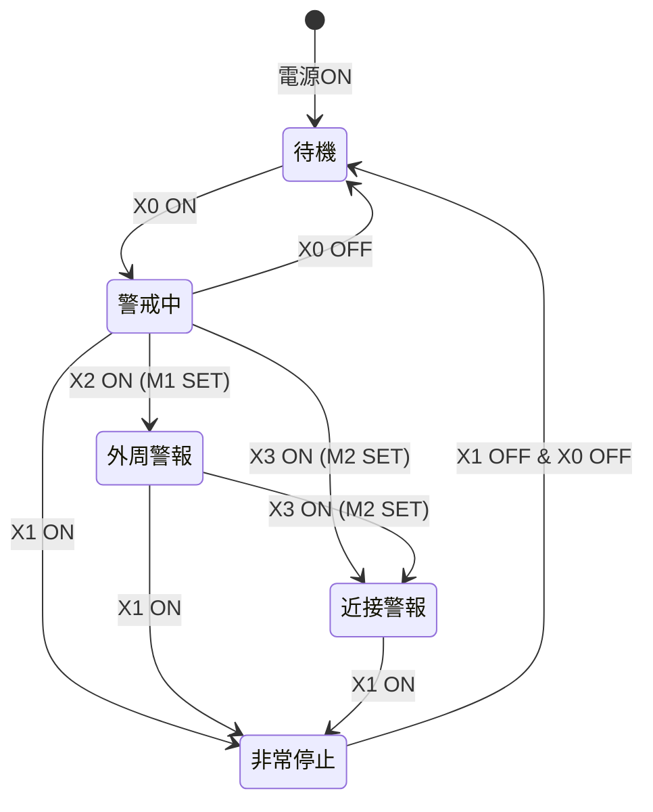

# TiSLY_HOME_Security_DEMO — ラダー図（参考）

プロジェクト名: **TiSLY_HOME_Security_DEMO**  
PLC: 三菱 FX系 / GX Works2・3

GX Works への手入力、または本ドキュメントを参照してラダーを組んでください。  
**段3（非常停止）は段6（Y0 出力）より前に配置**してください。

---

## 段1：警戒ON保持

```
|--[ X0  警戒ON ]------[/ X1  非常停止 ]------( SET M0  警戒中 )--|
```

**コメント:** セレクタで警戒開始。非常停止中は SET しない。

---

## 段2：警戒OFFリセット

```
|--[/ X0  警戒ON ]------( RST M0 )--|
|                      ( RST M1 )--|
|                      ( RST M2 )--|
```

**コメント:** 警戒 OFF で M0/M1/M2 をすべて解除。出力は下位段で自動 OFF。

---

## 段3：非常停止

```
|--[ X1  非常停止 ]------( RST M0 )--|
|                      ( RST M1 )--|
|                      ( RST M2 )--|
|                      ( RST Y0 )--|
|                      ( RST Y1 )--|
|                      ( RST Y2 )--|
|                      ( RST Y3 )--|
|                      ( RST Y4 )--|
```

**コメント:** 非常停止で全状態リセット・全出力 OFF。段6 より前に配置すること。

---

## 段4：センサー1警報保持（外周）

```
|--[ M0  警戒中 ]------[ X2  外周BS ]------( SET M1 )--|
```

**コメント:** 警戒中に外周ビーム検知 → M1 保持（ラッチ）。

---

## 段5：センサー2警報保持（近接）

```
|--[ M0  警戒中 ]------[ X3  近接BS ]------( SET M2 )--|
```

**コメント:** 警戒中に近接ビーム検知 → M2 保持（ラッチ）。

---

## 段6：Y0 赤ライト（M20 経由・単一コイル）

```
|--[ M2  近接警報 ]------[ M8012  0.1sCLK ]--+--( M20  Y0制御 )--|
|                                            |
|--[/ M2 ]--[ M0  警戒中 ]--[ M8013  1sCLK ]-+

|--[ M20 ]--( Y0  24V赤 )--|
```

**コメント:**
- M2 成立時 … 0.1秒高速点滅（M8012）を **最優先**
- M2 非成立かつ M0 … 1秒低速点滅（M8013）
- Y0 は M20 経由のみ（二重コイルなし）

---

## 段7：Y1 白ライト1

```
|--[ M1  外周警報 ]--( Y1  100V白1 )--|
```

**コメント:** 外周警報時、常時点灯。

---

## 段8：Y2 白ライト2

```
|--[ M1  外周警報 ]------[ M8013  1sCLK ]--( Y2  100V白2 )--|
```

**コメント:** 外周警報時、1秒周期点滅。

---

## 段9：Y3 白ライト3

```
|--[ M2  近接警報 ]--( Y3  100V白3 )--|
```

**コメント:** 近接警報時、常時点灯。

---

## 段10：Y4 白ライト4

```
|--[ M2  近接警報 ]--( Y4  100V白4 )--|
```

**コメント:** 近接警報時、常時点灯。

---

## END

プログラム末尾に **END** 命令を配置してください。

---

## 動作イメージ（状態遷移）


