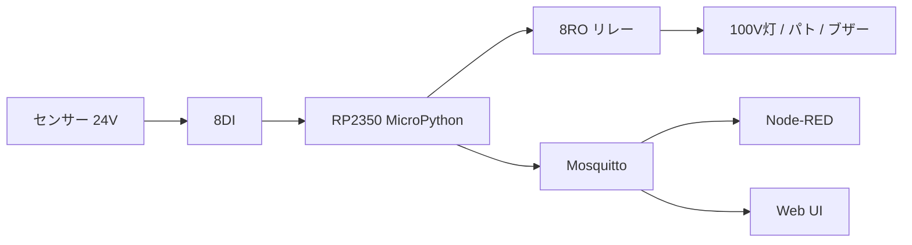

# TiSLY RP2350 Edition — Home Security

**Waveshare RP2350 PoE (8DI / 8RO / Ethernet)** 専用。ESP 版とは混在しません（作業は `rp2350/` のみ）。

## 目的

- 市販モジュールのみでホームセキュリティを構築（PLC 不使用）
- 実機到着後すぐ接続テストできるよう、config・ファーム・MQTT・Node-RED・Web UI を事前整備
- 実機未到着でも PC 上で論理・MQTT シミュレーション可能

## 構成



## フォルダ説明

| パス | 内容 |
|------|------|
| `config/` | device, network, mqtt, gpio_map, relay_map, sensor_map |
| `firmware/` | MicroPython（main, boot, managers, mqtt_client） |
| `docs/` | mqtt_topics, rp2350_first_setup, wiring |
| `test/simulator/` | PC 用 MQTT / 論理テスト |
| `node-red/` | `tisly_rp2350_v1.json`（RP 専用） |
| `web/` | スマホ向け 6 ページ UI |
| `mqtt/` | Mosquitto スニペット |

## 動作ルール

| 入力 | 動作 |
|------|------|
| DI1/DI2 赤外線 ON | RO1/RO2 ON → event → MQTT |
| DI3/DI4 人感 ON | event のみ |
| DI5/DI6 窓 ON | RO3/RO4 ON → alarm event |
| DI7 非常 ON | 全 RO ON + `alarm_mode: true`（retain） |
| デバウンス | 50 ms |
| heartbeat | 30 s |

実装: `firmware/safety_manager.py` · 定義: `config/sensor_map.json`

## MQTT 構成

ベース: `tisly/rp2350/{device_id}/`（既定 `rp2350-home-01`）

| トピック | 用途 |
|----------|------|
| `.../state` | DI/RO/alarm_mode スナップショット（retain 推奨） |
| `.../event` | イベント JSON |
| `.../alarm` | 警報（retain） |
| `.../heartbeat` | 30 秒生存 |
| `.../cmd/alarm_clear` | 解除 |
| `.../relay/{n}/set` | リレー 0/1 |

詳細: [docs/mqtt_topics.md](docs/mqtt_topics.md)

旧 `tisly/home/*` は Phase 1〜10 用（`tisly_home_v1.json`）で、RP2350 では使いません。

## 実機到着前に完了したこと

- [x] config 6 ファイル（gpio はピン TODO のみ、仮番号なし）
- [x] ファームウェアモジュール分割・動作ルール
- [x] ホスト論理テスト `test/simulator/test_logic_host.py`
- [x] MQTT シミュレータ雛形
- [x] Node-RED `tisly_rp2350_v1.json`
- [x] Web UI（Home / Sensors / Relays / Events / Settings / About）
- [x] セットアップ手順書 `docs/rp2350_first_setup.md`

## 実機到着後にやること

1. [docs/rp2350_first_setup.md](docs/rp2350_first_setup.md) に従い MicroPython 書き込み
2. [TODO.md](TODO.md) のピン番号・リレー論理・DI 極性を確認・記入
3. `config/gpio_map.json` 更新後、ファームデプロイ
4. MQTT / DI / RO / Node-RED / Web UI を順に確認

## クイックテスト（PC）

```bash
# 論理のみ（MQTT 不要）
python rp2350/test/simulator/test_logic_host.py

# MQTT（ブローカー起動後）
python rp2350/test/simulator/simulator_publish.py 192.168.1.10
python rp2350/test/simulator/simulator_inputs.py 192.168.1.10
```

## Node-RED

- インポート: `node-red/tisly_rp2350_v1.json`
- Dashboard: `http://<host>:1880/ui`

## Web UI

```bash
python -m http.server 8080 --directory rp2350/web
```

Settings で WebSocket URL を設定（例: `ws://192.168.1.10:9001`）。

## 参考

- [Waveshare RP2350-ETH-8DI-8RO Wiki](https://www.waveshare.com/wiki/RP2350-ETH-8DI-8RO)
- 未完了一覧: [TODO.md](TODO.md)
